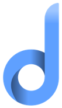

<h1>ashup</h1>

The dashup platform provides a quick overview over multiple widgets that can be used for productivity purposes. Its 
intention is to standardize the usage of different widgets by defining a global design and functionality policy. 
Furthermore it helps to unite different kinds of productivity tools on one central platform and adapts the visualization 
of widgets to individual needs. Each widget is represented by a widget on the dashup platform containing different 
components for data visualization and user interaction. Whereas users are provided with a collection of default widgets 
at the beginning, they can later enhance their central dashboard with further widgets from the dashup store. In addition, 
there should be the possibility to integrate self-developed widgets consuming external APIs to visualize data in 
order to make precise predictions and planning. Dashup is therefore considered to be a productivity tool, running as a 
web application on modern browsers.