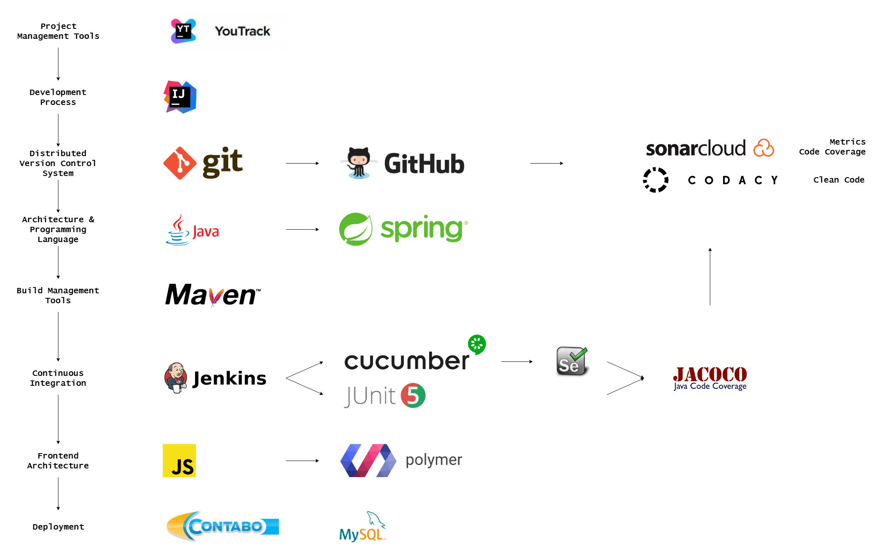

# Dashup - Test Plan
====================
### Version 2.0

# Revision history

| Date       | Version | Description                                          | Author           |
|------------|---------|------------------------------------------------------|------------------|
| 25/04/2019 | 1.0     | Initial Documentation                                | Raphael Müßeler  |
| 07/05/2019 | 2.0     | Addition of new test type                            | Raphael Müßeler  |
| 26/05/2019 | 3.0     | Addition of metrics                                  | Sven Leonahrd    |

# Table of Contents

- [Introduction](#1-introduction)
    - [Purpose](#11-purpose)
    - [Scope](#12-scope)
    - [Intended Audience](#13-intended-audience)
    - [Document Terminology and Acronyms](#14-document-termonlogy-and-acronyms)
    - [References](#15-references)
- [Evaluation Mission and Test Motivation](#2-evaluation-mission-and-test-motivation)
    - [Background](#21-background)
    - [Evaluation Mission](#22-evaluation-mission)
    - [Test Motivators](#23-test-motivators)
- [Target Test Items](#3-target-test-items)
- [Outline of Planned Tests](#4-outline-of-planned-tests)
    - [Outline of Test Inclusions](#41-outline-of-test-inclusions)
    - [Outline of other candidates for Potential Inclusion](#42--outline-of-other-candidates-for-potential-inclusion)
    - [Outline of Test Exclusions](#43-outline-of-exclusions)
- [Test Approach](#5-test-approach)
    - [Testings Techniques and Types](#51-testing-techniques-and-types)
        - [Unit Testing](#511-unit-testing)
        - [User Interface Testing](#512-user-interface-testing)
        - [Smoke Testing](#513-smoke-testing)
- [Entry and Exit Testing](#6-task-and-exit-criteria)
    - [Test Plan](#61-test-plan)
        - [Test Plan Entry Criteria](#611-test-plan-task-criteria)
        - [Test Plan Exit Criteria](#612-test-plan-exit-criteria)
- [Deliverables](#7-deliverables)
    - [Test Evaluation Summaries](#71-test-evaluation-summaries)
    - [Reporting on Test Coverage](#72-reporting-on-test-coverage)
    - [Perceived Quality Reports](#73-perceived-quality-report)
    - [Incident Logs and Change Requests](#74-incident-logs-and-change-requests)
    - [Smoke Test Suite and Supporting Test Scripts](#75-smoke-test-suite-and-supporting-test-scripts)
- [Testing Workflow](#8-testing-workflow)
- [Environmental Needs](#9-environmental-needs)
    - [Base System Hardware](#91-base-system-hardware)
    - [Base Software Elements in the Test Environment](#92-base-software-elements-in-the-test-environment)
    - [Productivity and Support Tools](#93-productivity-and-support-tools)
- [Responsibilities, Staffing, and Training Needs](#10-responsibilities-staffing-and-training-needs)
    - [People and Roles](#101-people-and-roles)
    - [Staffing and Training Needs](#102-staffing-and-training-needs)
- [Iteration Milestones](#11-iteration-milestones)
- [Risks, Dependencies, Assumptions, and Constraints](#12-risks-dependencies-assumptions-and-constraints)
- [Metrics](#13-metrics)

## 1 Introduction

## 1.1 Purpose

The purpose of the Iteration Test Plan is to gather all of the information necessary to plan and control the test effort for a given iteration. It describes the approach to testing the software, and is the top-level plan generated and used by managers to direct the test effort.

This _Test Plan_ for **dashup** supports the following objectives:

- Identifies the items that should be targeted by the tests.
- Identifies the motivation for and ideas behind the test areas to be covered.
- Outlines the testing approach that will be used.
- Identifies the required resources and provides an estimate of the test efforts.

## 1.2 Scope

Within the **dashup** project we use unit and integration testing. Unit tests have to purpose to test single logical 
units primarily within the backend, since there is the main logic placed. Integration tests help us to test and 
end-to-end scenario. Furthermore they test the 2 other layers: views and controllers.

This means that we are only testing for functionality (logic), usability, and reliability. Since our tests run on a CI 
server that measures time, we are able to easily check if we have a performance flaw.  

## 1.3 Intended Audience

This test plan is written generally for ourselves as contributors. As this document is on a technical level, the general 
target audience is more advanced readers with the necessary background knowledge. 

### 1.4 Document Termonlogy and Acronyms

| Abbrevation | Description                            |
| ----------- | -------------------------------------- |
| CI          | Continuous Integration                 |
| n/a         | not applicable                         |

## 1.5 References

| Reference                                                                                | Date       |
|------------------------------------------------------------------------------------------|------------|
| [Dashup Blog](https://dashup2k18.wordpress.com/)                                         | 12/06/2019 |
| [GitHub Repository](https://github.com/raphaelmue/dashup)                                | 12/06/2019 |
| [Jenkins](http://jenkins.raphael-muesseler.de/job/dashup)                                | 12/06/2019 |
| [CMPP](http://github.com/raphaelmue/dashup/blob/master/docs/specifications/cmpp/CMPP.md) | 12/06/2019 |

## 2 Evaluation Mission and Test Motivation

### 2.1 Background

Unit and integration tests allow us to keep track of issues and bugs, when there are future changes. Their code coverage 
gives us information about how well our application is covered with tests. When deploying our application without any 
test failures, we can at least be sure, that all of our tests cases are working correctly. 

Furthermore, when using an CI server, we become aware of issues of bugs, if some tests fail. We benefit from this as we 
can save time and effort. 

### 2.2 Evaluation Mission

With the help of tests, we are able to provide a stable and working version of our application. This helps us to 
certify to a standard for our customers. As already said, tests also help us to find possible issues or bugs. Especially 
UI tests are designed according to the BDD principles to meet the expectations of our clients.

### 2.3 Test Motivators

Quality as well as stability are the main reason for us to implement tests. Besides it helps us within the process of 
development as we can detect bugs without spending time on manual testing. 

## 3 Target Test Items

The listing below identifies those test items for software, hardware and supporting product elements that have been 
identified as targets for testing. This list represents what items will be tested:

- Java backend functionality and logic
- Frontend usability and functionality

## 4 Outline of Planned Tests

### 4.1 Outline of Test Inclusions

We will test units of our backend and the integration between frontend and backend. The integration tests of course do 
test the frontend as well. 

### 4.2  Outline of other Candidates for Potential Inclusion

By now, we do not have any performance tests. We can only keep track of the time measurements that the CI server 
creates when testing. If this is not going to be out of the ordinary, there is no need for those tests. 

### 4.3 Outline of Exclusions

We will not tests our widgets and their components. This would require the creation of a new testing environment that is 
not based on Java and thus more resources to implement these tests. Furthermore there is no specification of how widgets 
should be designed und what their behaviour and features should be as they are created by users according to individual 
needs.

## 5 Test Approach

### 5.1 Testing Techniques and Types

#### 5.1.1 Unit Testing

Unit tests describe automated tests that test only the smallest units of software or logic. All dependencies of this 
smallest unit are mocked, so that only the function of the smallest unit is tested. These smallest units are mostly 
methods of different classes. The intention of unit tests is to test the functional parts of a software for correctness. 

|                        | Description                                                 |
| ---------------------- | ----------------------------------------------------------- |
| Technique Objective    | Ensuring that the implemented unit works as expected.       |
| Technique              | Verifying that the expected result and no error occurs.     |
| Oracles                | Test logs, console printing, code coverage                  |
| Required Tools         | JUnit Jupiter (Maven Dependency)                            |
| Success Criteria       | Tests must pass and coverage must be higher than threshold. |
| Special Considerations | -                                                           |

#### 5.1.2 User Interface Testing

There is also the possibility to test the user interface of a software. Depending on the language and framework used, 
there is usually a corresponding UI test framework. This tests whether the user interface functions properly and whether 
the user input is handled correctly.

|                        | Description                                                 |
| ---------------------- | ----------------------------------------------------------- |
| Technique Objective    | Ensuring that the implemented UI works as expected.         |
| Technique              | Verifying that the expected result and no error occurs.     |
| Oracles                | Test logs, console printing, watching tests, code coverage  |
| Required Tools         | Selenium (Maven Dependency)                                 |
| Success Criteria       | Tests must pass and coverage must be higher than threshold. |
| Special Considerations | Running UI tests headless on a CI server without an UI.     |

#### 5.1.3 Smoke Testing

Smoke tests are a subset of test cases that cover the most important functionality of a component or system, used to aid assessment of whether main functions of the software appear to work correctly.

|                        | Description                                                 |
| ---------------------- | ----------------------------------------------------------- |
| Technique Objective    | Ensuring that the basic functionality works correctly.      |
| Technique              | Verifying that the expected result and no error occurs.     |
| Oracles                | Test logs, console printing, watching tests, code coverage  |
| Required Tools         | Selenium & JUnit (Maven Dependency)                         |
| Success Criteria       | Tests must pass. 
age is not suitable.                  |
| Special Considerations | Running UI tests headless on a CI server without an UI.     |

## 6 Entry and Exit Criteria

## 6.1 Test Plan

### 6.1.1 Test Plan Entry Criteria

If a contributors commits new changes, they will automatically be tested. This build and test process is executed on our 
CI server, which is in this case Jenkins. 

### 6.1.2 Test Plan Exit Criteria

The test process should not be exited. Even if there are failures at the end, the other tests will run anyway to 
determine which tests failed. 
 
## 7 Deliverables

### 7.1 Test Evaluation Summaries

For our application we are using Jenkins as CI tool. On the one hand Jenkins performs the build process and on the other 
hand Jenkins executes unit and integration tests. 

| CI Service | Badge |
| ---------- | ----- |
| Jenkins    |  |

The following image shows how the tests are running with JUnit Jupiter in IntelliJ, whereas the second image shows build 
process in Jenkins.

There is more information about our Jenkins multibranch pipeline in our CMPP.

### 7.2 Reporting on Test Coverage

If the Jenkins build was successful, the code coverage will be reported to the GitHub plugin _Codacy_. This badge shows 
the current code coverage on the master branch: 

### 7.3 Perceived Quality Report

We are measuring our code quality with the help of _Codacy_. It checks for clean code and security or performance 
improvements. The following badge shows the quality of the code on the master branch: 

### 7.4 Incident Logs and Change Requests

Codacy and Jenkins are integrated into GitHub's pull request. If a new feature is implemented, all these checks will be 
executed when there is a new pull request for this feature. Furthermore, there is even a build for merging the branch 
into the master:

### 7.5 Smoke Test Suite and Supporting Test Scripts

We integrated in our test workflow smoke tests as well, to check before committing changes, whether the basic functionality works or not. Smoke tests are explained earlier (see [5.1.3 Smoke testing](#513-smoke-testing)) 

Each master build publishes a code coverage result, that can be seen also here: 

## 8 Testing Workflow

Each contributor has the opportunity to execute the tests locally, since there are run configurations on the GitHub 
repository. This helps a lot, when implementing tests and new features.

Furthermore, after each commit, all tests will be executed. 

## 9 Environmental Needs

### 9.1 Base System Hardware

There is no specific hardware required, but a good hardware leads to the fact that all test will run much faster.

### 9.2 Base Software Elements in the Test Environment

The following base software elements are required in the test environment for this Test Plan.

| Software Element Name | Version     | Type                                    |
| --------------------- | ----------- | --------------------------------------- |
| Java                  | 11          | Programming Language                    |
| Maven                 | 3.5         | Dependency Management Plugin for Java   |
| MariaDB               | 10.3        | SQL Database                            |
| ChromeDriver          | 74.0.3729.6 | Driver to run selenium tests in Chrome  |
| FirefoxDriver         | v0.24.0     | Driver to run selenium tests in Firefox |

### 9.3 Productivity and Support Tools

The following tools will be employed to support the test process for this Test Plan.

| Tool Category or Type                  | Tool Brand Name                                                             |
| -------------------------------------- | ----------------------------------------------------------------------------|
| Code Hoster                            | [GitHub](https://www.github.com/raphaelmue/dashup/)                         |
| Test Coverage and Code Quality Monitor | [Codacy](https://app.codacy.com/project/dashup/dashup/dashboard)            |
| Continuous integration tool            | [Jenkins](https://jenkins.raphael-muesseler.de/)                            |
| Continuous code inspection tool        | [SonarCloud](https://sonarcloud.io)                                         |
| Metrics calculation plugin (IntelliJ)  | [Metrics Reloaded](https://plugins.jetbrains.com/plugin/93-metricsreloaded) |

The following figure shows our technology stack of our application:

## 10 Responsibilities, Staffing and Training Needs

### 10.1 People and Roles

This table displays the staffing assumptions for the test effort of our project.

| Role          | Minimum Resources Recommended | Specific Responsibilities                                               |
| ------------- | :---------------------------: | ----------------------------------------------------------------------- |
| Test Manager  | 1                             | Ensures that testing is complete and conducted for the right motivators |
| Test Analyst  | 1                             | Selects what to test based on the motivators                            |
| Test Designer | 1                             | Decides what tests should be implemented                                |
| Tester        | 3                             | Implements and runs the tests                                           |

### 10.2 Staffing and Training Needs
    
The following trainings are needed for writing tests:
    
- Writing JUnit tests
- Writing selenium tests

## 11 Iteration Milestones

Our goal is to keep instruction coverage above **70%** and branch coverage above **50%** for the classes we are testing.

## 12 Risks, Dependencies, Assumptions and Constraints

Some use cases might be very hard to test. Furthermore testing all branches is not applicable for this project, since we 
do not have that much resources.

## 13 Metrics
Metrics are used to numerically evaluate the code. It helps to find critical code sections, examine them more precisely and eliminate them in the best case. 
For this purpose, we have integrated [sonarcloud.io](https://sonarcloud.io) into our CI process. This can be seen on the screenshot of our Jenkins Pipeline at the step **Analyze Project**.

Sonar's dashboard gives an overview of the current code situation. Serious errors and grievances can be detected quickly. The dashboard is public and can be accessed [here](https://sonarcloud.io/dashboard?id=dashup).

For more detailed metrics around the code the Intellij Plugin Metrics Reloaded is used. Here metrics of different categories can be automatically generated. In this way you can get a lot of information about the code and act if necessary. The following is about the [Chidamber & Kemerer object-oriented metrics suite](https://www.aivosto.com/project/help/pm-oo-ck.html), which unites various metrics.

Two of these are Weighted Methods per Class (WMC) and Response for a Class (RFC). We will take a closer look at these two values now. WMC counts the number of methods in each class. This value is relevant because you want to avoid too many methods. This makes it difficult to maintain and reuse the code. Somewhat more complex is RFC. The methods are also counted here. In addition to this value, the number of methods that are called within the methods of the class are also counted. A high RFC value usually means that the class is more prone to errors. The complexity of the class is high. This can lead to difficulties in understanding and make both testing and debugging more difficult. 

If you look at the values for WMC and RFC, you will notice the *Database* and the *DashupService* class. There are clear anomalies here that need to be reduced. Due to the architecture of dashup, there are some difficulties here. On the one hand we want to provide the functionality for CRUD operations in one place, on the other hand we want to establish a clear structure. In refactoring we tried to combine both approaches. The result is the [issue112 branch](https://github.com/raphaelmue/dashup/tree/issue112). Here all changes can be traced. This [link](https://github.com/raphaelmue/dashup/tree/fe4a4964f4358f86b3296718511ec6bc97874fd1) leads to a commit before the refactor work. The table shows the before/after values. 

| Class                                 | RFC before | RFC after | WMC before | WMC after |
|---------------------------------------|------------|-----------|------------|-----------|
| de.dashup.model.service.DashupService | 154        | 139       | 81         | 74        |
| de.dashup.model.db.Database           | 56         | 53        | 36         | 32        |

Another metric is Lack of Cohesion in Methods (LCOM). There are different versions from 1 to 4. According to documentation, the metric tool uses LCOM1. Basically, this metric measures the coherence of methods. This should be as high as possible. Therefore, it is important that the LCOM value is low. During the calculation all possible method pairs are considered. If both methods access one or more equal attributes, a variable Q is incremented by one otherwise, a variable called P is incremented by one. If P is greater than Q at the end, the LCOM value will be P - Q, otherwise LCOM is 0. If the values are high, you should consider splitting the affected class. More information about that can be found [here](https://www.aivosto.com/project/help/pm-oo-cohesion.html#LCOM1).

With a value of 12, the *DatabaseWidget* class has a particularly high value, which requires to take a closer look at that code. However, since the class represents the database entry of a widget, we decided not to make any changes here. The class is only needed to make CRUD operations possible in the software. So, it contains instance variables that can be read or written with the help of getters and setters only. We do not consider changes to be useful, since some components require the functionality of this class. Furthermore, it makes no sense to split the class, because it represents an atomic object in this context of the software.

