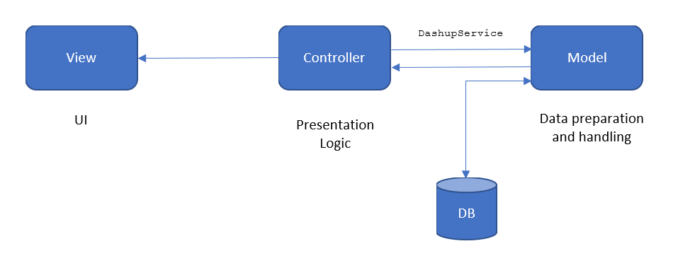
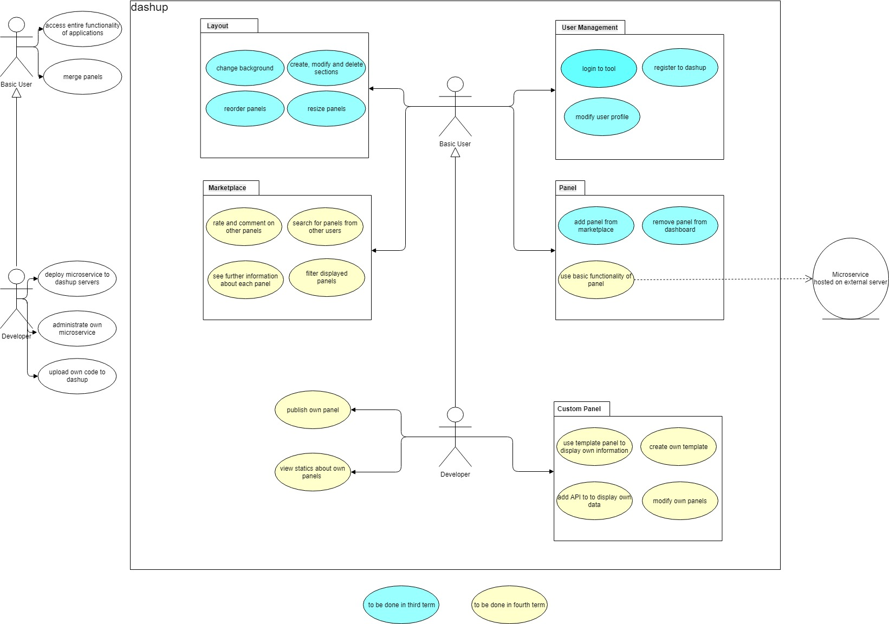
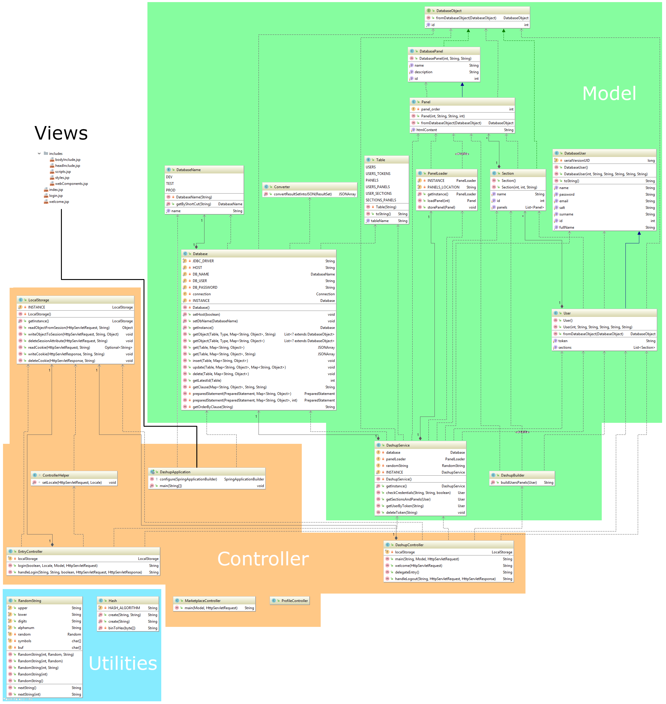
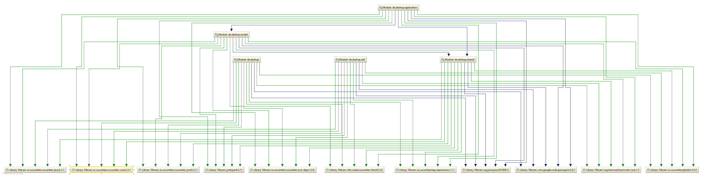
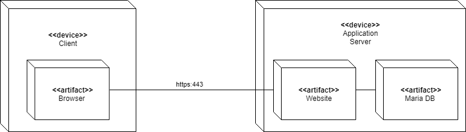
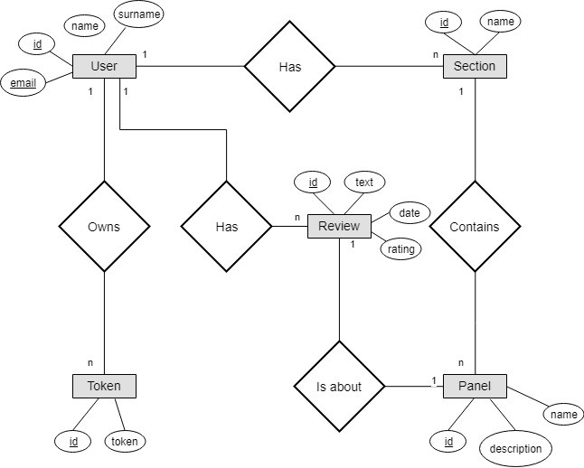
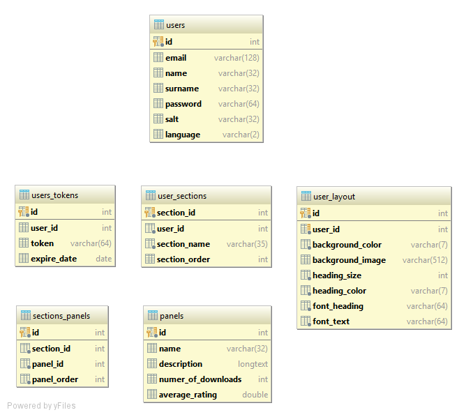

# Software Architecture Document

# Table of Contents
- [Introduction](#1-introduction)
    - [Purpose](#11-purpose)
    - [Scope](#12-scope)
    - [Definitions, Acronyms and Abbreviations](#13-definitions-acronyms-and-abbreviations)
    - [References](#14-references)
    - [Overview](#15-overview)
- [Architectural Representation](#2-architectural-representation)
- [Architectural Goals and Constraints](#3-architectural-goals-and-constraints)
- [Use-Case View](#4-use-case-view)
    - [Use-Case Realizations](#41-use-case-realizations)
- [Logical View](#5-logical-view)
    - [Overview](#51-overview)
    - [Architecturally Significant Design Packages](#52-architecturally-significant-design-packages)
- [Process View](#6-process-view)
- [Deployment View](#7-deployment-view)
- [Implementation View](#8-implementation-view)
    - [Overview](#81-overview)
    - [Layers](#82-layers)
- [Data View](#9-data-view)
- [Size and Performance](#10-size-and-performance)
- [Quality](#11-quality)

## 1. Introduction

### 1.1 Purpose

This document provides a comprehensive architectural overview of the system, using a number of different architectural views to depict different aspects of the system. It is intended to capture and convey the significant architectural decisions which have been made on the system.

### 1.2 Scope

This document describes the technical architecture of the Dashup project, including module structure and dependencies as well as the structure of classes.

### 1.3 Definitions, Acronyms and Abbreviations

| Abbrevation | Description                            |
| ----------- | -------------------------------------- |
| API         | Application programming interface      |
| MVC         | Model View Controller                  |
| REST        | Representational state transfer        |
| SDK         | Software development kit               |
| SRS         | Software Requirements Specification    |
| UC          | Use Case                               |
| VCS         | Version Control System                 |
| n/a         | not applicable                         |

### 1.4 References

| Title                                                              | Date       | Publishing organization   |
| -------------------------------------------------------------------|:----------:| ------------------------- |

### 1.5 Overview

This document contains the Architectural Representation, Goals and Constraints as well as the Logical, Deployment, Implementation and Data Views.

## 2. Architectural Representation

Our project dashup uses the classic MVC structure as follows:



## 3. Architectural Goals and Constraints

As our main technology we decided to use Spring MVC, which is a framework that takes not only care of the back-end but also of the front-end. Besides is the Controller and Model language Java, so that we do not have to care about serialization. 

The main architectural goal of this project is portability, distribution and reuse. Since we want our users to customize their dashup as much as their want, everything has to be kept abstract and to be made for reuse. 

But of course, the dashup project should be safe as we are storing user sensitive data that should not fall into wrong hands.

Architectural constraints for this project might be the interaction with panels, since we do not allow the user to upload executable code for security reasons. So the developer might be limited when it comes to the interaction of the user with the developers panels. But we do accept this limitation, because of the security goal. 

## 4. Use-Case View

This is our overall use-case diagram:



## 5. Logical View

### 5.1 Overview

We split our architecture according to the MVC architecture as follows:



We are working with maven modules, because it allows us to modularize the project better. We defined our module structure as follows:

```
|-- de.dashup
|   |-- application
|   |-- model
|   |-- shared
|   |-- util
``` 

For this maven module structure has the following dependency graph:

 

### 5.2 Architecturally Significant Design Packages

The module `de.dashup.application` contains all controllers, the main application as well as all views. In this module, the Spring MVC framework is realized. However, the module `de.dashup.model` is outsources, so that the controllers cannot directly access the database. This is all handled by the class `DashupService` which represents the interface between Controllers and Models. 

The module `de.dashup.shared` contains all classes that find use in the Controllers as well as in the Model. Same applies for the module `de.dashup.util`, except that it contains only utility classes, where as `de.dashup.shared` compromises the whole modeling.

## 6. Process View

n/a

## 7. Deployment View

This is our deployment view:



We only have one instance of an application server due to lack of capacity. The database is running as well on the server due to the same reason.

## 8. Implementation View

n/a

## 9. Data View

Our data view is modelled as followed:



Note that the current database scheme looks a bit different. Here are the current
tables, that we use in order to generate the main dashboard:



## 10. Size and Performance

n/a

## 11. Quality/Metrics

To ensure a high quality we are using Jenkins as an continuous integration tools. It automatically builds, tests and deploys the application, if the respective previous step has not failed. This happens periodically and when changes are pushed to a branch. 