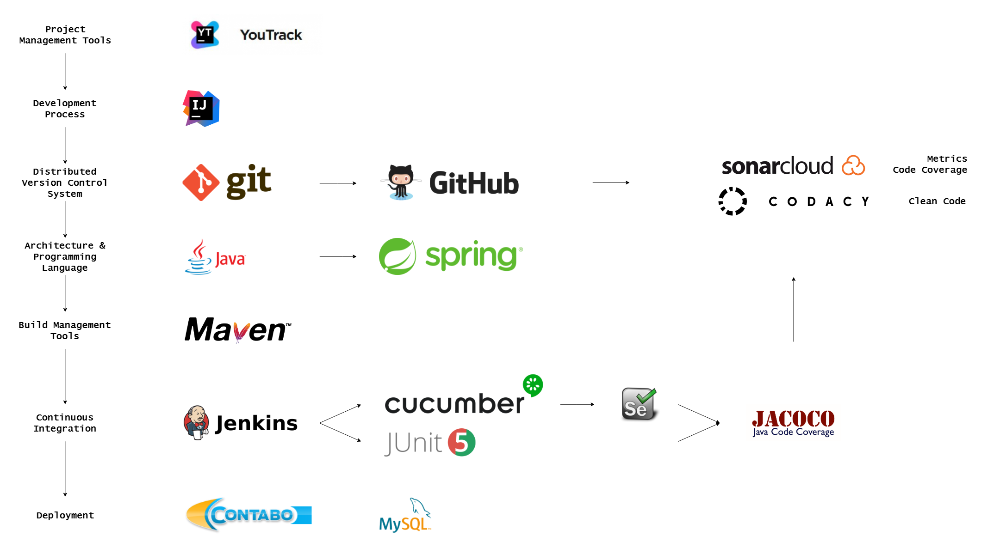

# Dashup - Configuration Management Project Plan

### Version 1.0
  
# Revision history
  
| Date       | Version | Description                                          | Author           |
|------------|---------|------------------------------------------------------|------------------|
| 12/06/2019 | 1.0     | Initial Documentation                                | Raphael Müßeler  |

# Table of Contents
- [1 Introduction](#1-introduction)
    - [1.1 Purpose](#11-purpose)
    - [1.2 Scope](#12-scope)
    - [1.3 Definitions, Acronyms and Abbreviations](#13-definitions-acronyms-and-abbreviations)
    - [1.4 References](#14-references)
- [2 Tech Stack](#2-tech-stack)
    - [2.1 Contribution and development process](#21-contribution-and-development-process)
- [3 Project Management](#3-project-management)
- [4 Development and Architecture](#4-development-and-architecture)
- [5 Continuous Integration](#5-continuous-integration)
    - [5.1 Definition](#51-definition)
    - [5.2 Jenkins](#52-jenkins)
    - [5.3 Multibranch Pipeline](#53-multibranch-pipeline)
    - [5.4 Stages and steps](#54-stages-and-steps)
- [6 Deployment](#6-deployment)

# 1 Introduction

## 1.1 Purpose

The purpose of this document is to define the Configuration Management of the project *dashup*. 

This __Configuration Management Project Plan__ for the project **dashup** supports the following objectives:

- Outlines the developing and contributing process.
- Defines the continuous integration workflow. 
- Identifies the tech stack that is used.
 
## 1.2 Scope

As a continuous integration service, we use __Jenkins__ for **dashup**. In this project we will focus only on Jenkins 
as we have shown that it best fits our project requirements. For now, there will be no other continuous integration 
service. 

## 1.3 Definitions, Acronyms and Abbreviations

| Abbrevation | Description                            |
| ----------- | -------------------------------------- |
| CI          | Continuous Integration                 |
| n/a         | not applicable                         |

## 1.4 References

| Reference                                                                             | Date       |
|---------------------------------------------------------------------------------------|------------|
| <a href="https://dashup2k18.wordpress.com/">Dashup Blog</a>                           | 12/06/2019 |
| <a href="https://github.com/raphaelmue/dashup">GitHub Repository</a>                  | 12/06/2019 |
| <a href="https://youtrack.dashup.de/issues">YouTrack</a>                              | 12/06/2019 |
| <a href="https://www.youtube.com/channel/UCkzyPZ1hoasZHXEwxLfDu2w">YouTube</a>        | 12/06/2019 |
| <a href="http://jenkins.raphael-muesseler.de/job/dashup">Jenkins</a>                  | 12/06/2019 |
| <a href="https://sonarcloud.io/dashboard?id=dashup">SonarCloud</a>                    | 12/06/2019 |

# 2 Tech Stack 

The technology stack for the **dashup** application looks as follows:

This technology stack gives a quick overview about how developing and contributing to the project **dashup** works. In 
addition, contributors are informed which tools are used and for what purpose. 

## 2.1 Contribution and development process

In the following, the contribution and development process is described:

1. A contributor creates - before starting to develop - a new issue on GitHub (as well as on YouTrack) which he/she 
describes what this feature / issue / bug is about.
1. This contributor only works on the branch set up for this issue. Each commit triggers our continuous integration 
service to run the changes. 
1. When this feature / issue / bug is finished, the respective contributor creates a new Pull Request on GitHub and asks 
the other contributors for a review. In this PR, all checks will be executed. If all checks were successfully and the 
other contributors approved this PR, it can be merged into master.
1. When there are enough new features to release, the deployment stage starts.  

# 3 Project Management

As we are using agile project management, we integrated YouTrack into our development process. It gives us the 
possibility to track our project management. You can find further information on that in our Blog Posts.  

# 4 Development and Architecture

Our architecture is described in our Software Architecture Document, as well as information about our Build Management 
Tools.

# 5 Continuous Integration

## 5.1 Definition

Continuous integration is a term from software development that describes the process of continuously assembling 
components into an application. It aims to increase software quality. Typical actions are the compilation and build 
processing of application parts, but in principle any other operations can be performed to generate derived information. 
Usually, not only the complete system is rebuilt, but also automated tests are performed and software metrics to measure 
the software quality are created. The entire process is triggered automatically by checking into version management.

## 5.2 Jenkins

Jenkins is an extensible, web-based software system for the continuous integration of components into an application 
program. It is considered a fork of Sun's Hudson software, now Oracle.

Here you find the latest master build: 

## 5.3 Multibranch Pipeline

To take full advantage of the functionality of Jenkins, we decided to create a multibranch pipeline. This feature helps 
us to make use of Jenkins' advantages on every branch and pull request, that we create.

In Jenkins, multibranch pipelines are defined by a so called __Jenkinsfile__. This file contains all stages and steps 
that will be executed when running a job on Jenkins. Basically every action can be executed in this pipeline, for 
instance shell commands, printing messages or collecting information from the job. 

You can find the Jenkinsfile for **dashup** [here](https://github.com/raphaelmue/dashup/blob/master/Jenkinsfile). 

## 5.4 Stages and steps

The multibranch pipeline for dashup looks as follows:

1. Stage: Building the project. 
    
    In this stage, the whole project is compiled and built. Since **Maven** is our __Build Management Tool__, we achieve 
    this by executing the goals `mvn clean install -DskipTests`. This gives us proof that there are no syntax errors in 
    the project. 
    
1. Stage: Preparing tests.

    This stage is used to copy the `database.conf` into the project's directory, so that now all tests can run and 
    access the database. 
    
1. Stage: Running JUnit Tests.

    In this stage all unit tests will be executed. You can find further information on unit testing in our 
    [Test Plan](https://github.com/raphaelmue/dashup/blob/master/docs/architectures/testing/test_plan.md) Document.
    
1. Stage: Running integration tests in Chrome.
    
    This stage is for executing all integration tests in Google's Chrome Browser. You can find further information on 
    integration testing in our [Test Plan](https://github.com/raphaelmue/dashup/blob/master/docs/architectures/testing/test_plan.md) 
    Document.
    
1. Stage: Running integration tests in Firefox.
        
    This stage is for executing all integration tests in Mozialla's Firefox Browser. You can find further information on 
    integration testing in our [Test Plan](https://github.com/raphaelmue/dashup/blob/master/docs/architectures/testing/test_plan.md) 
    Document.
        
1. Stage: Analyzing Project

     After all tests went green, Jacoco has automatically collected information on the code coverage. This data as well 
     as other information are now sent to Sonar, which will after that analyze the project.
     
# 6 Deployment

For the deployment process, we do have an extra branch called `deployment`. This branch is always the latest released 
version that is deployed on [dashup.de](http://dashup.de/). 

When it is time for a new release, the master branch is merged into the deployment branch and this triggers the Jenkins 
service to run the new job. On this branch, there is a special stage called **Deployment**, which restart the 
application on the latest version. 

You can checkout the status of the deployment branch here: 
