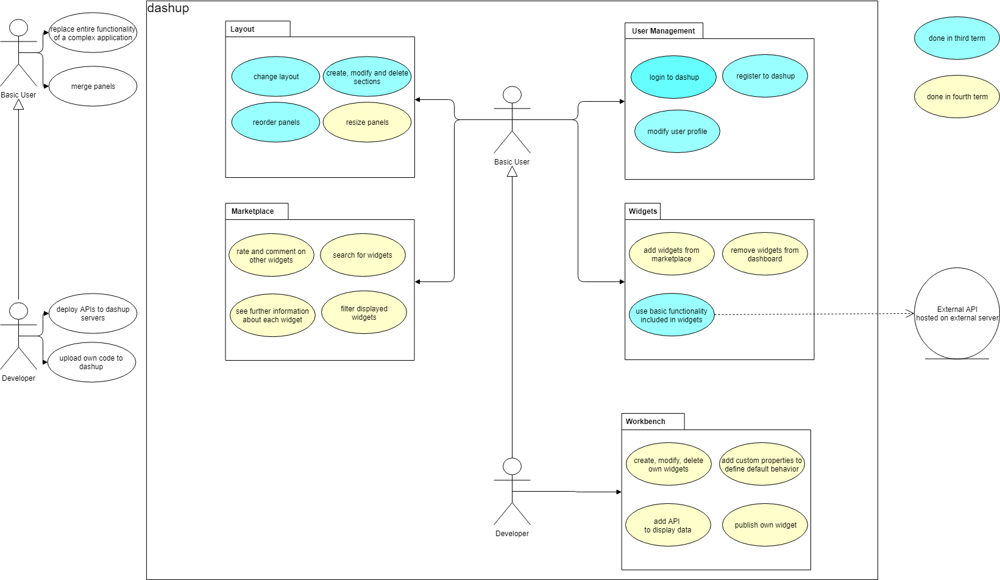

# Software Architecture Document
================================
### Version 2.0

# Revision history

| Date       | Version | Description                                          | Author           |
|------------|---------|------------------------------------------------------|------------------|
| 15/11/2018 | 1.0     | Initial Documentation                                | Raphael Müßeler  |
| 08/04/2019 | 2.0     | Reworked diagrams and small adjustments              | Raphael Müßeler  |

# Table of Contents
- [Introduction](#1-introduction)
    - [Purpose](#11-purpose)
    - [Scope](#12-scope)
    - [Definitions, Acronyms and Abbreviations](#13-definitions-acronyms-and-abbreviations)
    - [References](#14-references)
    - [Overview](#15-overview)
- [Architectural Representation](#2-architectural-representation)
- [Architectural Goals and Constraints](#3-architectural-goals-and-constraints)
- [Use-Case View](#4-use-case-view)
- [Logical View](#5-logical-view)
    - [Overview](#51-overview)
    - [Architecturally Significant Design Packages](#52-architecturally-significant-design-packages)
- [Process View](#6-process-view)
- [Deployment View](#7-deployment-view)
- [Implementation View](#8-implementation-view)
    - [Overview](#81-overview)
    - [Layers](#82-layers)
- [Data View](#9-data-view)
- [Size and Performance](#10-size-and-performance)
- [Quality/Metrics](#11-qualitymetrics)

## 1. Introduction

### 1.1 Purpose

This document provides a comprehensive architectural overview of the system, using a number of different architectural 
views to depict different aspects of the system. It is intended to capture and convey the significant architectural 
decisions which have been made on the system.

### 1.2 Scope

This document describes the technical architecture of the Dashup project, including module structure and dependencies as 
well as the structure of classes.

### 1.3 Definitions, Acronyms and Abbreviations

| Abbrevation | Description                            |
| ----------- | -------------------------------------- |
| API         | Application programming interface      |
| MVC         | Model View Controller                  |
| REST        | Representational state transfer        |
| SDK         | Software development kit               |
| SRS         | Software Requirements Specification    |
| UC          | Use Case                               |
| VCS         | Version Control System                 |
| n/a         | not applicable                         |
| DAO         | Data Access Object                     |
| DTO         | Data Transfer Object                   |

### 1.4 References

| Title                             | Date       | Publishing organization   |
| --------------------------------- | ---------- | ------------------------- |

### 1.5 Overview

This document contains the architectural representation, goals and constraints as well as logical, deployment, 
implementation and data views.

## 2. Architectural Representation

Our project dashup uses the classic MVC structure as follows:


## 3. Architectural Goals And Constraints

As our main technology we decided to use Spring MVC, which is a framework that takes not only care of the backend but 
also of the frontend. Besides the controller and model language is Java, so that we do not have to care about 
serialization. 

The main architectural goal of this project is portability, distribution and reuse. Since we want our users to customize 
their dashup in any way they want, everything has to be kept abstract and must be made for reuse. 

But of course, the dashup project should be safe as we are storing user sensitive data that should not fall into wrong 
hands.

Architectural constraints for this project might be the interaction with widgets, since we do not allow the user to 
upload executable code for security reasons. So the developer might be limited when it comes to the interaction of the 
user with the developers widgets. But we do accept this limitation, because of the security goal. 

## 4. Use-Case View

This is our overall use-case diagram:



## 5. Logical View

### 5.1 Overview

We split our architecture according to the MVC architecture as follows:


We are working with maven modules, because it allows us to modularize the project better. We defined our module 
structure as follows:

```
|-- de.dashup
|   |-- application
|   |-- model
|   |-- shared
|   |-- util
``` 

For this maven module structure has the following dependency graph:

 

### 5.2 Architecturally Significant Design Packages

The module `de.dashup.application` contains all controllers, the main application as well as all views. In this module, 
the Spring MVC framework is realized. However, the module `de.dashup.model` is outsources, so that the controllers 
cannot directly access the database. This is all handled by the class `DashupService` which represents the interface 
between Controllers and Models. 

The module `de.dashup.shared` contains all classes that find use in the controllers as well as in the model. Same 
applies for the module `de.dashup.util`, except that it contains only utility classes, where as `de.dashup.shared` 
compromises the whole modeling.

## 6. Process View

n/a

## 7. Deployment View

This is our deployment view:


We only have one instance of an application server due to lack of capacity. The database is running as well on the 
server due to the same reason.

## 8. Implementation View

n/a

## 9. Data View

Our data view is modelled as followed:


Note that the current database scheme looks a bit different regarding the name of the tables and fields. Here are the 
current tables, that we use in order to generate the main dashboard:


## 10. Size and Performance

n/a

## 11. Quality/Metrics

To ensure a high quality we are using Jenkins as an continuous integration tool. It automatically builds, tests, 
measures and deploys the application, if the respective previous step has not failed. This happens periodically and when 
changes are pushed to a branch. When merging the master branch into the deployment branch, th application will 
automatically be deployed as well.

To see which metrics we use as well as which tool we use for such purposes, please have a look at the [Test Plan](). 

## 12. Patterns

Dashup provides a central dashboard with widgets for private productivity usage. Users can create custom widgets using 
dashups web components. Before having a look at dependency injections and lazy initialization, creational design 
patterns, a client requested every dashup web component available, as he could possibly need it for his widgets to be 
rendered on the dashboard. Of course, that meant, that a whole lot of web components are pushed to the client in vain, 
increasing average response time and decreasing performance. With these two patterns, only the web components needed at 
the moment are loaded lazily. New web components will only be loaded, when users add new widgets to their dashboard.

To implement dependency injection to realize lazy initialization, we first had to make the dependencies to inject as 
modular as possible. Fortunately, web components are naturally designed modular, each web component in imported as a 
JavaScript module into the browser session, so no need to add extra logic for the so-called module pattern. The web 
platform APIs already offers a way to include JavaScript modules instead of normal scripts into the browser session.

To now implement the dependency injection pattern, further changes were needed. The pattern regulates the dependencies 
of an object at runtime. If, for instance, an object needs another object during its initialization, this dependency is 
stored at a central location – it is therefore not generated by the initialized object itself. To load the required 
dependencies, new tables in the database were needed, that store the relationship between a widget and its required 
components. So when each widget is now loaded into a data access object, additional information on the required 
components are now stored in a list within this object. This is done by a service method that runs as soon as a client 
requests the central dashboard and requests the widgets. Within a builder class, the dependencies located in the data 
access objects are then injected into a JSP View, which is sent back to the client. The client then knows exactly, which 
components to load and therefore reduces the payload. So in the end, widgets do no longer need to take care of loading 
and initializing their dependencies, as this is already done by service and builder methods in the backend and pushed to 
the client.

This thought hits the true point of lazy initialization or lazy loading, as dependencies get only injected and 
initialized the moment it is really needed and not from the very beginning. So when a client adds a new widget to his 
dashboard, then and only then the required new web components get loaded.

CLASS DIAGRAMM

To see which changes were made, please have a look at the methods highlighted red inside the orange marked classes. 
Classes belonging to an architectural design pattern are highlighted blue. But these classes can most of the time either 
be associated with the MVC or Frontcontroller architectural pattern. Anyways, there are as well some so called 
Data Access Objects (DAO) or Data Transfer Objects (DTO) highlighted in blue. They are used to deserialize data send 
from the database into normal Java objects or to abstract information from a DAO class to better use it in dashboard 
construction algorithms.