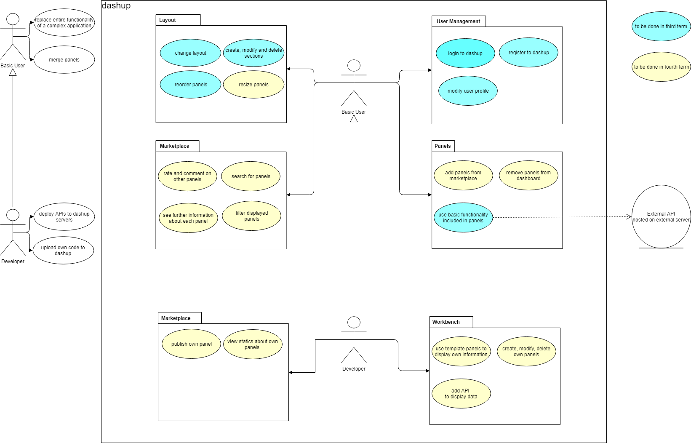
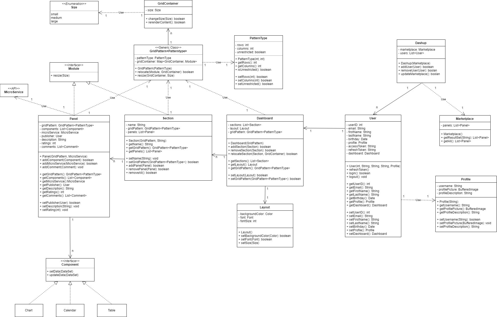
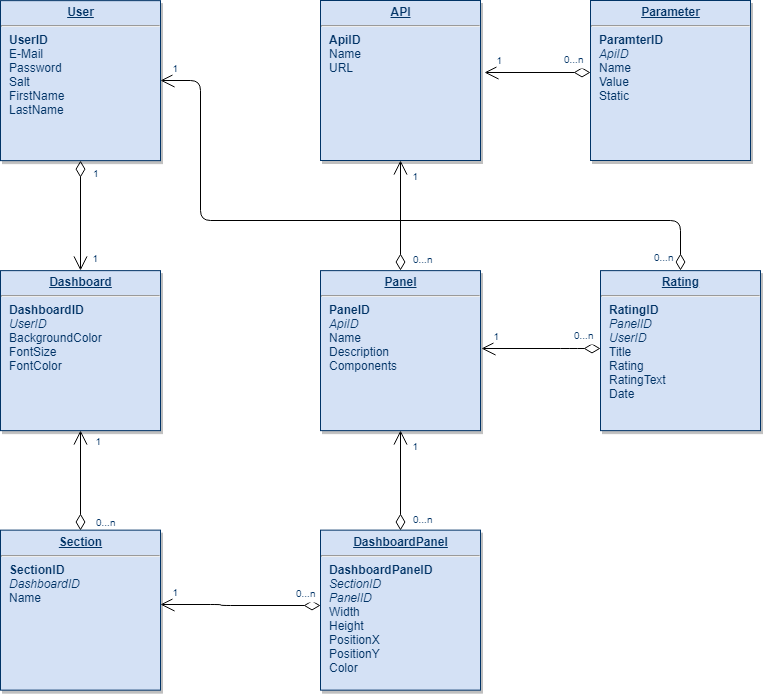

dashup - Software Requirements Specification
============================================
### Version 2.0

# Revision history

| Date       | Version | Description                                          | Author           |
|------------|---------|------------------------------------------------------|------------------|
| 21/10/2018 | 1.0     | Initial Specification                                | Felix Hausberger |
| 28/10/2018 | 1.1     | Marketplace and Layout                               | Sven Leonhard    |
| 14/11/2018 | 1.2     | System Architecture                                  | Felix Hausberger |
| 09/03/2019 | 2.0     | Refactoring                                          | Felix Hausberger |

# Table of Contents

- [Introduction](#1-introduction)        
    - [Purpose](#11-purpose)
    - [Scope](#12-scope)
    - [Definitions, Acronyms and Abbreviations](#13-definitions-acronyms-and-abbreviations)
    - [References](#14-references)
    - [Overview](#15-overview)
 - [Overall Description](#2-overall-description)
    - [Project Vision](#21-project-vision)
    - [General Use Case Diagram](#22-general-use-case-diagram)
 - [Specific Requirements](#3-specific-requirements)
    - [System Architecture](#31-system-architecture)
    - [Functionality](#32-functionality)
    - [Usability](#33-usability) 
    - [Reliability](#34-reliability)
    - [Performance](#35-performance)
    - [Supportability](#36-supportability)
    - [Dependencies](#37-dependencies)
    - [Design Constraints](#38-design-constraints)
    - [Purchased Components](#39-purchased-components)
    - [Interfaces](#310-interfaces)
    - [Licensing Requirements](#311-licensing-requirements)
    - [Legal, Copyright, Other Notices](#312-legal-copyright-other-notices)
 - [Further Information](#4-further-information)  

# Software Requirements Specification

# 1. Introduction

## 1.1 Purpose
This software requirements specification was created to collect and organize the requirements for the dashup platform. 
Agreeing on a general consent between the developer teams expertise and the clients interests and expectations, the 
specification contains all realistic requirements, that are compatible with the projects vision. Therefore it describes 
the expected functional and nonfunctional requirements of the platform and makes it transparent to the community, which 
can therefore gain a better overview over the projects scope. Furthermore it is needed to evaluate the results of the 
project after its status is considered to be completed and ready for transition. 

## 1.2 Scope
The dashup platform provides a quick overview over multiple widgets that can be used for productivity purposes. Its 
intention is to standardize the usage of different widgets by defining a global design and functionality policy. 
Furthermore it helps to unite different kinds of productivity tools on one central platform and adapts the visualization 
of widgets to individual needs. Each widget is represented by a panel on the dashup platform containing different 
components for data visualization and user interaction. Whereas users are provided with a collection of default widgets 
at the beginning, they can later enhance their central dashboard with further widgets from the dashup store. In addition, 
there should be the possibility to integrate self-developed widgets consuming external APIs to visualize data in 
order to make precise predictions and planning. Dashup is therefore considered to be a productivity tool, running as a 
web application on modern browsers.     

## 1.3 Definitions, Acronyms and Abbreviations

| Definition    | Description                                                                    |
|---------------|--------------------------------------------------------------------------------|
| Dashup        | Name of the product and project                                                |
| Dashup-panel  | Relatively simple and easy-to-use software component on the dashup platform    |
| Spring MVC    | Java based model-view-controller framework, architecture used behind dashup    |

 

| Abbreviation | Explanation                         |
|--------------|-------------------------------------|
| SRS          | Software Requirements Specification |
| UCD          | Use Case Diagram                    |
| MTBF         | Mean Time Between Failures          |
| MTTR         | Mean Time To Recover                |
| MVC          | Model View Controller               |
| HTTP         | Hypertext Transfer Protocol         |

## 1.4 References

| Reference                                                                             | Date       |
|---------------------------------------------------------------------------------------|------------|
| <a href="https://dashup2k18.wordpress.com/">Dashup Blog</a>                           | 21/10/2018 |
| <a href="https://github.com/raphaelmue/dashup"> GitHub Repository</a>                 | 21/10/2018 |
| <a href="https://youtrack.dashup.de/issues">YouTrack</a>                              | 21/10/2018 |
| <a href="http://jenkins.raphael-muesseler.de/job/dashup">Jenkins</a>                  | 21/10/2018 |

## 1.5 Overview
In the next chapter, the general vision as well as the general UCD will be provided, in order to give a quick summary 
about the scope of the project. The more in depth specification of the project will follow in the chapter <i>Specific 
Requirements</i>. How the web application is constructed and why these technologies are used is described in the chapter 
<i>System Architecture</i>. Every feature that dashup provides as well as the constraints when using dashup-panels, 
will be explained in chapter <i>Functionality</i> going over to <i>Usability</i> and <i>Reliability</i> claims of 
dashup. Furthermore, <i>Performance</i>, <i>Supportability</i> and <i>Dependencies</i> will be a part of the 
specification, giving information about our service level agreements, development standards like design policies, 
maintenance and used third-party libraries. In the chapter <i>Design Constraints</i> further requirements, tools and 
constraints are listed. <i>Purchased components</i> play a minor role within the dashup project, but should still be 
mentioned. <i>User-, Software- and Communication-Interfaces</i> on the other hand, will be described in chapter 
<i>Interfaces</i>. To finish of the specification, the <i>Legal, Copyright, Other Notices</i> chapter offer insights in 
the allowed range of usage of our application, idea and brand. If any questions are left open or an adaption of the SRS 
in needed, please contact one of the developers listed in <i>Further Information</i>.

# 2 Overall Description

## 2.1 Project Vision
In today's digital world, automation is everything. To keep up with modern achievement-oriented society, people need to 
accomplish daily tasks and planning more efficiently. Therefore people are used to create or consume multiple personal 
productivity tools. Keeping an overview over your own pool of tools might occur difficult sometimes. Usage is complex, 
platforms are different and a common design is screwed up. Inspired by this efficiency loss, we create dashup to give 
you the ultimate tool to get back on track again.

Dashup helps you to get through daily tasks easier by providing various widgets for typical private productivity usage 
scenarios on a central platform. Design your platform according to individual needs, take use of a wide range of dashup-
widgets from our store or create your own productivity widget and add external APIs to feed it with data to evaluate. 
You can even publish your widget to a broad community. Dashup saves you from spending too much time on analyzing data or 
using complex applications. You can take use of each widget restricted to the essential set of features on one central 
platform, thus leading to more efficiency. Each widget will be displayed as its own panel according to global design 
policies on the central dashboard. 

All in all, dashup will provide you the best experience and overview over all daily productivity tools on a central 
platform.

## 2.2 General Use Case Diagram
Following UCD will provide a basic overview to the user characteristics, features, constraints, associations and 
dependencies within the project scope. Furthermore, non-functional requirements are put outside the system boundaries.
 
 

# 3 Specific Requirements

## 3.1 System Architecture

## 3.1.1 Class Diagram

## 3.1.2 Database Scheme

## 3.2 Functionality

### 3.2.1 Dashboard
When opening dashup in your browser, all widgets are displayed as panels on a central dashboard structured in 
sections. Each panel in a section can contain multiple components used for data visualization and user interaction. You 
can easily customize your central dashboard by for instance changing the layout or the order of sections and panels on 
the dashboard. To change the layout, navigate to the <i>Settings</i> menu. Changing the order of sections and panels can 
be done directly in the central dashboard. Each dashup-panel is a web component and itself build with web components. For 
a detailed specification for all available web components please see the extra <a href="../dashup_web_components">dashup 
web components</a> specifications. Besides you can also manage you personal profile settings in the <i>Settings</i> menu 
or navigate to the dashup marketplace by using the <i>Marketplace</i> menu. 

### 3.2.2 Marketplace
In the marketplace all available panels for widgets are offered to you. You can simply search, rate and comment on 
panels. To find your desired panels faster, you can set filters for the search to adapt the result set. The offered 
range of panels reach from default dashup-panels, that are natively available on the dashup platform, to custom user 
panels, that were uploaded by users. A detailed view is offered for each offered panel containing a description and 
comments about the panel. Furthermore, similar panels to the current inspected panel, that other users use as well in 
combination with the current one, are displayed in a <i>similar</i> tab. As a developer it is possible to publish your 
own panels for widgets as well as taking a look at the usage statistics of your published panels. The marketplace is as 
well the key entry point oo add panels to the central dashboard.
(Use Case: <a href="../ucs/marketplace/UCS_marketplace.md">Marketplace</a>)

### 3.2.3 User Management
User management includes registration and login processes as well as adapting your personal profile. Each user is 
referenced by a unique e-mail address and authenticated by a confirmation e-mail to his entered e-mail address during 
registration process. During registration users have to provide a username, e-mail address and password. The password 
has to be repeated correctly. To log in users have to provide the password and e-mail address for their account and are 
directed to the central dashboard if all credentials entered are correct. Browser cookies will store user sessions, 
making repeated login processes redundant. In the <i>Settings</i> menu, users can adapt personal information like 
name, birthday, company or a short biography and profile picture. Note that personal information are not required during 
registration process. Furthermore the unique username, login credentials and language settings are changeable. 
(Use Case: <a href="../ucs/user_management/login_register/UCS_login_register.md">Login And Register</a>)
(Use Case: <a href="../ucs/user_management/change_profile/UCS_change_profile.md">Change Profile</a>)

### 3.2.4 Layout
The platform should enable the user to create, modify and delete sections and fill these sections with the desired 
panels. A rearrangement of sections as well as panels should be possible by drag and drop on the central dashboard. 
Panels can be moved between sections and resized between small, medium or large size. 
(Use Case: <a href="../ucs/layout/change_panel_structure/UCS_change_panel_structure.md">Change Panel Structure</a>)

The user can also change the layout of dashup by choosing a theme, font and background image for the central dashboard. 
These settings can be changed in the <i>Settings</i> menu. 
(Use Case: <a href="../ucs/layout/change_layout/UCS_change_layout.md">Change Layout</a>)

### 3.2.5 Workbench

As each user can create custom panels, the extent of usage and functionality is up to the user himself. Note that users 
can only take use of dashup web components to build own custom panels. Any program logic must be hosted as an external 
API offering RESTful services. A user (developer role) has the possibility to connect such an API to his self-developed 
panel in order to fetch data to display on the panel or to run server-side program logic. Therefore information like 
URL, parameters and credentials have to be entered by the user. Before the API can be added, testing the connection is 
necessary. 
(Use Case: <a href="../ucs/workbench/add_api/UCS_add_api.md">Add API</a>)

## 3.3 Usability
Dashups goal is it to simplify the usage of complex applications by offering (custom) widgets, which restrict the 
possibilities of interaction to a minimum. Only what is really needed to use a productivity tool will be available as 
interaction methods for the widget making it lightweight and fast. By uniting different productivity tools to one 
central platform, credentials, storage and time can be saved which increases productivity. Having additional global 
design and functionality policies, all widgets have a common foundation which supports the platform feeling and 
increases customer experience.

## 3.4 Reliability

### 3.4.1 Availability
The dashup platform should be always available. Since bugs can lead to a crash, we assume that dashup has an up-time of 
99.5% per month. The MTBF should not fall below a number of 7 days. However, the MTTR should not exceed a number of 12 
hours. 

### 3.4.2 Accuracy
Since we review our code, the defect rate should be about 10 bugs per 1.000 lines of code. Critical bugs like loss of 
data or limitations within functionality should of course occur less. Minor bugs are for instance the incorrect display 
of data. Significant bugs are e.g. no sufficient consistency check or similar. As users should be made possible to 
create custom panels using the dashup web components, XSS attacks should be prevented.

## 3.5 Performance

### 3.5.1 Response Time
The response time should be as low as possible. The reload of the page may not take longer than 5 seconds and in average 
a response time of 3 seconds is acceptable. Rendering of widgets should not depend on response times of external APIs. 
There requesting data should happen asynchronously.

Furthermore the web application should orient its implementation according to a progressive web application development 
style meaning that for instance rerendering of ui components should be restricted to the necessary parts.

### 3.5.2 Throughput
The information displayed on the different panels showed in the dashboard should be reloaded every 10s. The 
provision of data by external APIs and servers should therefore have a decent response time.

### 3.5.3 Capacity
The web application has to be designed for a large number of users. An increase of new members should not slow down the system 
in the same way. The amount of widgets that can be displayed on the central dashboard should remain unrestricted. 
Pagination should only be used in the marketplace. Furthermore only one API can be added to a custom panel.

### 3.5.5 Resource Utilization
If capacity is not sufficient enough for the current demand, highly-scalable server-side infrastructures like Kubernetes 
should be used to dynamically administrate the amount of running server instances. Load balancers should direct incoming
requests to less utilized instances guaranteeing the same performance for any client. 

## 3.6 Supportability

### 3.6.1 Standards and Conventions
To ensure a clear structure within the project the latest clean code standards have to be applied including: 
* Intuitive names for variables and methods
* Classes with first letter uppercase
* Variables with first letter lowercase
* Comments to improve understanding and readability of the code
* Design patterns integration
* No hard-coded strings
* No premature optimization
* Secure transfer of data

If necessary there can be exceptions to this rules, but they have to be well considered and discussed. In addition, any 
file or folder published in the GitHub repository should start with a lowercase letter. Pictures are to be saved as png 
format. Every web component and the general design of the dashup platform must be compliant to the new Google Material 
UI design policy.

### 3.6.2 Maintenance
For optimal results, the use of tools for automated testing is essential. Furthermore, every line of code has to be 
reviewed to ensure compliance with the previously defined conventions and specifications. The porduct will most likely 
not be maintained any longer beginning from July 2019.

## 3.7 Dependencies
Find the list of used dependencies below:
- Polymer LitElement
- Google Material Design

## 3.8 Design Constraints

### 3.8.1 Software Languages
Dashup offers internationalization by supporting german and english language.

### 3.8.2 Software Process Requirements
Before getting published, dashup must be tested by native users. Afterwards it will be published as an open beta until 
it finally gets released about half a year later.

### 3.8.3 Developmental tools
Find the list of used developmental tools below:
- JetBrains IntelliJ: Spring MVC backend development
- JetBrains WebStorm: Polymer frontend development
- Git: Version control system
- YouTrack: Project planning tool
- Jenkins: Continuous integration and delivery
- Draw.IO: Architectural diagrams
- Balsamiq: UI mockups

### 3.8.4 Architectural Constraints
The project must be based on the MVC architecture. Therefore the Spring MVC framework will be in use.  Furthermore it 
should not be possible to upload executable code to dashup servers. 

## 3.9 Purchased Components
A virtual server is rented on hardware side. Furthermore a domain was purchased to make dashup available over the 
world wide web.

## 3.10 Interfaces

### 3.10.1 User Interfaces
- Start screen: Simple welcome page with possibility to navigate to the login or registration screen
- Login screen: Provides login form
- Registration screen: Users can set up an new account
- Dashboard screen: Users can see all their added widgets for productivity use
- Profile screen: Users can edit and update their profile information
- Marketplace screen: All widgets for the dashup platform can be found and added to the central dashboard
- Layout screen: Change the design of dashup
- Workbench screen: Developers can create their own custom panels

### 3.10.2 Software Interfaces
The dashup application runs in a web browser. We will try to make it work in as many different web browsers as possible. 
As dashup is published under the BSD 3-Clause license and open source, every web component of dashup can be cloned from the 
GitHub repo. To see their interfaces have a look at their <a href="../dashup_web_components">specifications</a>.

### 3.10.3 Communications Interfaces
The web application should communicate with the Java backend and all embedded external APIs by a secured HTTP connection 
on Port 443. Requests to external APIs should be asynchronous to increase performance. Each external API should be 
designed according to the RESTful principles. Information on routing endpoints will be added to the specification 
later on. For each request to the dashup backend the user must be authenticated.

## 3.11 Licensing Requirements
Dashup is published under the BSD 3-Clause lincense. BSD 3-Clause is a permissive license similar to the BSD 2-Clause 
License, but with a 3rd clause that prohibits others from using the name of the project or its contributors to promote 
derived products without written consent. See the license <a href="../../../LICENSE">here</a>. Neither the name dashup 
nor the names of its contributors may be used to endorse or promote products derived from this software without specific 
prior written permission.

## 3.12 Legal, Copyright, Other Notices
The dashup team will not take any responsibility for data loss and other damages done to your productivity tools. Dashup 
uses user provided data only for a better community experience. Private data will not be shared or used for money 
generating purposes. The dashup logo may only be used for the official dashup application. We reserve the idea of dashup 
and therefore demand written requests for the use of similar ideas or applications.

# 4 Further Information
**For more information please contact:**
* <a href="mailto:felix.hausberger@t-online.de"> Felix Hausberger </a>
* <a href="mailto:sven.leonhard@7lofficial.de"> Sven Leonhard </a>
* <a href="mailto:raphael.muesseler@sap.com"> Raphael Müßeler </a>
* <a href="mailto:joshua.schulz@sap.com"> Joshua Schulz </a>