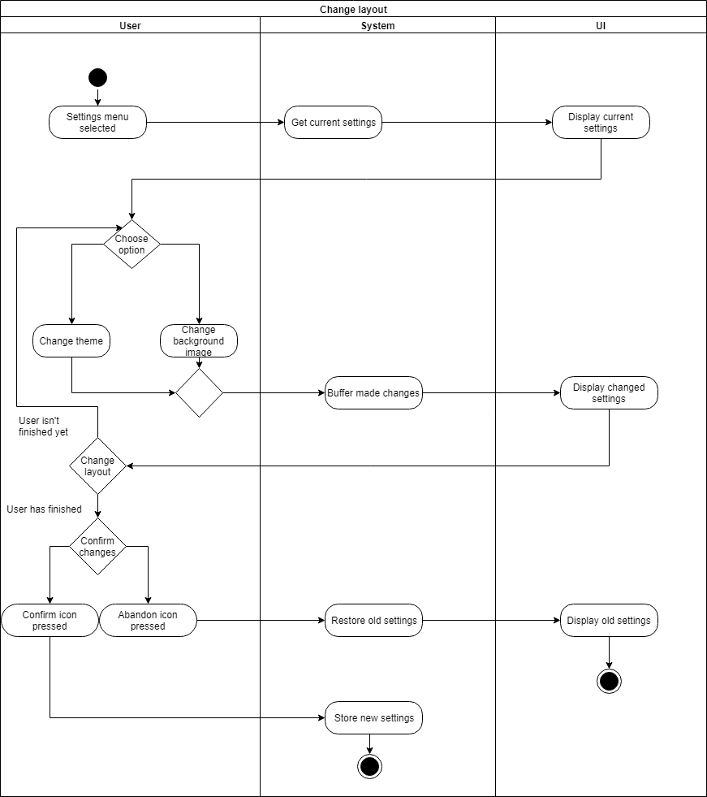
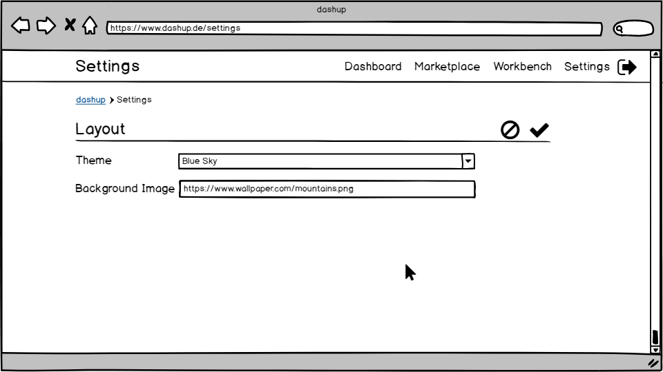

dashup - Use Case Specification: Layout - Change Layout
============================================
### Version 2.0

# Revision History

| Date       | Version | Description                                                            | Author           |
|------------|---------|------------------------------------------------------------------------|------------------|
| 28/10/2018 | 1.0     | Initial ucs with description, activity diagram and screen flow diagram | Joshua Schulz    |
| 09/03/2019 | 2.0     | Refactoring                                                            | Felix Hausberger |

# Table of Contents

- [Change Layout - Brief Description](#1-change-layout---brief-description) 
- [Flow Of Events](#2-flow-of-events)
    - [Basic Flow](#21-basic-flow)
    - [Alternative Flows](#22-alternative-flows)
- [Special Requirements](#3-special-requirements)
- [Preconditions](#4-preconditions)
    - [System State](#41-system-state)
- [Postconditions](#5-postconditions) 
    - [Save changed data](#51-save-changed-data)
    - [Discard changed data](#52-discard-changed-data)
- [Extension Points](#6-extension-points)
 
# 1. Change Layout - Brief Description
In the use case _change layout_ the user can change the layout dashup by choosing a theme, 
font and background image for the central dashboard. These settings can be changed in the <i>Settings</i> menu.  

# 2. Flow of Events

## 2.1 Basic Flow

### 2.1.1 Activity Diagram

### 2.1.2 Mock-Up

 

 

### 2.1.3 Narrative
You can see the entire _.feature file_ right <a href="./narratives/change_layout.feature">here</a>.

## 2.2 Alternative Flows
N/A

# 3. Special Requirements
All layout adaption must be compliant to our global design policies of using the new Google Material UI design. After 
having changed a layout setting, the view should get rerendered, so that the user can have an impression of the new 
layout. If the user likes the current status, he can activate the changes using the confirm icon or reset the changes 
with the abandon icon.

Following five themes are supported:
- Blue Sky: Light and happy design in blue
- Green Nature: Powerful and exotic design in green
- Red Love: Powerful and exotic design in red
- White Diamond: Plain but noble design in white
- Black Night: Plain but noble design in black

Following fonts are supported:
- Roboto
- Montserrat
- Overpass
- Poppins
- Lora
- Sniglet
- Inconsolata
- Indie Flower
- Anton
- Lobster
- Pacifico
- Cinzel
- Fredoka One
- Biblo
- Orbitron

# 4. Preconditions

## 4.1 System State
The user has to be signed in and must have navigated to the settings menu.

#  5. Postconditions

## 5.1 Save Changed Data
After the user has changed the layout settings and pressed the confirm icon the data has to be stored. This is necessary
to get a persistent change.

## 5.2 Discard changed data
If the user leaves dashup before saving the changes, the old settings will be restored.

#  6. Extension Points
If enough time is left after having implemented all use cases, maybe a separation between panel, section and dashboard 
layout settings could be implemented.