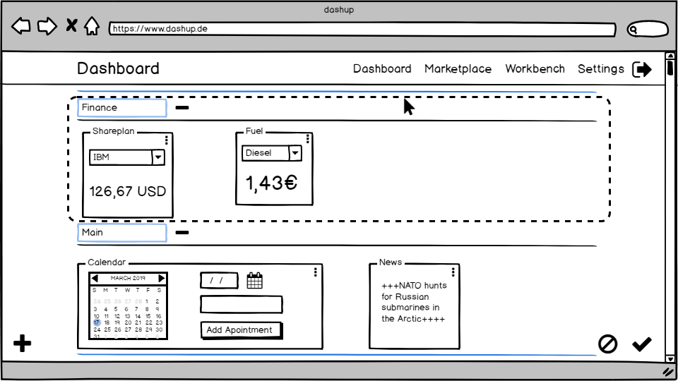
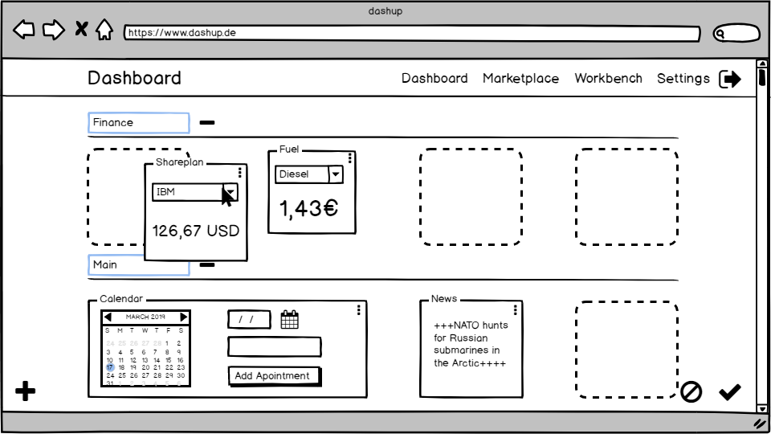
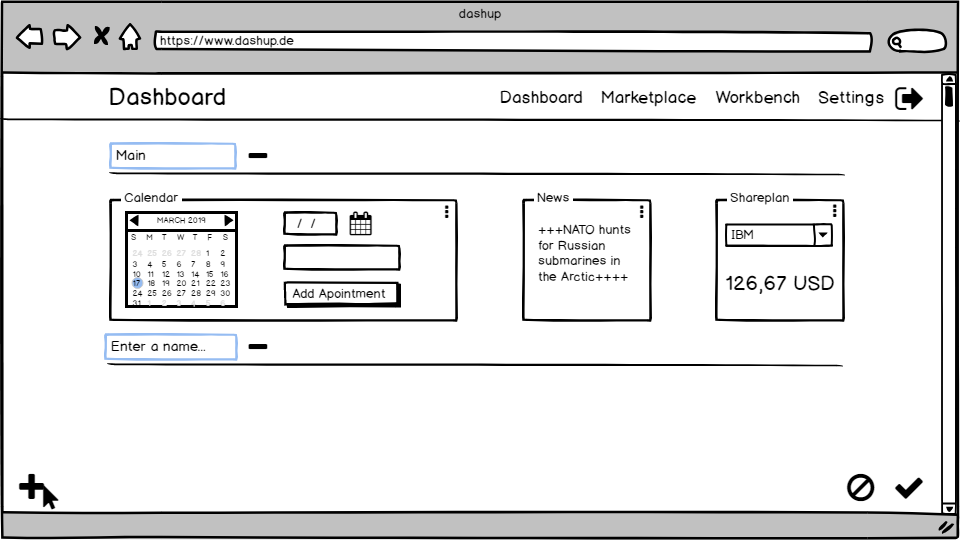

dashup - Use Case Specification: Layout - Change Panel Structure
============================================
### Version 1.0

# Revision History

| Date       | Version | Description                                                            | Author           |
|------------|---------|------------------------------------------------------------------------|------------------|
| 23/10/2018 | 1.0     | Initial ucs with description, activity diagram and screen flow diagram | Joshua Schulz    |
| 17/03/2019 | 2.0     | Refactoring                                                            | Felix Hausberger |

# Table of Contents

- [Change Panel Structure - Brief Description](#1-change-panel-structure---brief-description) 
- [Flow Of Events](#2-flow-of-events)
    - [Basic Flow](#21-basic-flow)   
    - [Alternative Flows](#22-alternative-flows)
- [Special Requirements](#3-special-requirements)
- [Preconditions](#4-preconditions)
    - [System State](#41-system-state)
- [Postconditions](#5-postconditions) 
    - [Save changed data](#51-save-changed-data)
    - [Discard changed data](#52-discard-changed-data)
- [Extension Points](#6-extension-points)

# 1. Change Panel Structure - Brief Description
In the use case _change panel structure_ the platform should enable the user to create, modify and delete sections and 
fill these sections with the desired panels. A rearrangement of sections as well as panels should be possible by drag 
and drop on the central dashboard. Panels can be moved between sections and resized between small, medium or large size. 

# 2. Flow of Events

## 2.1 Basic Flow

### 2.1.1 Activity Diagram

 
### 2.1.2 Mock-Up

 

 

 

 

 

 

 

### 2.1.3 Narrative
You can see the entire _.feature file_ right <a href="./narratives/change_panel_structure.feature">here</a>.

## 2.2 Alternative Flows
N/A

# 3. Special Requirements
If a section is deleted, all panels that are still contained in the section will be removed from the dashboard. 
Depending on which size is selected for a panel, the extent of information displayed in the panel will be adapted.

# 4. Preconditions

## 4.1 System State
The user has to be signed in and must have activated the edit mode.

# 5. Postconditions

## 5.1 Save changed data
After the user has personalized the central dashboard, the data has to be stored. This is necessary
to get a persistent change. 

## 5.2 Discard changed data
If the user leaves dashup before saving the changes, the old settings will be restored.

# 6. Extension Points
If enough time is left after having implemented all use cases, maybe renaming single panels could be considered to be 
implemented as well.