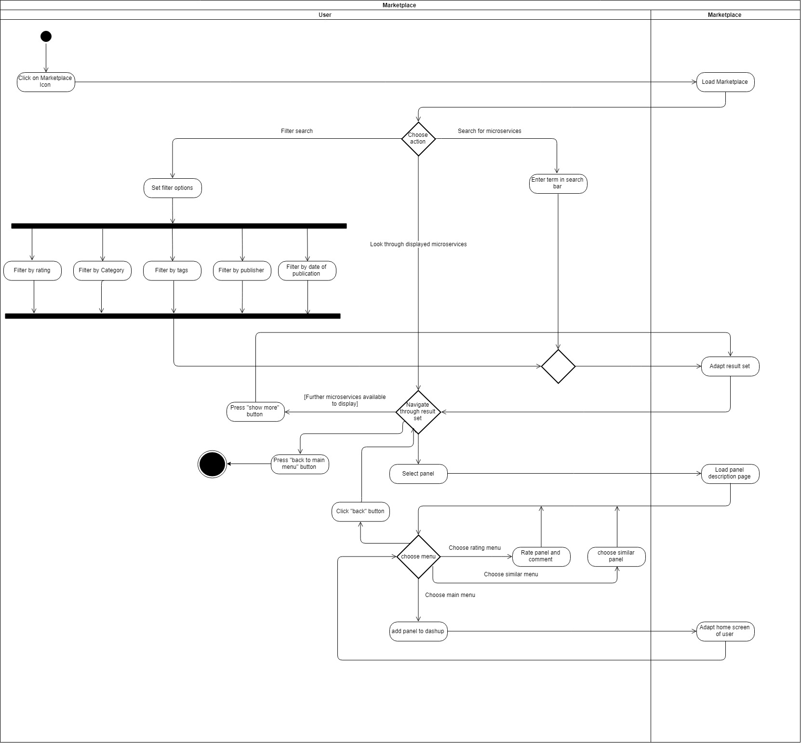

dashup - Use Case Specification: Marketplace
============================================
### Version 2.0

# Revision History

| Date       | Version | Description                                                            | Author           |
|------------|---------|------------------------------------------------------------------------|------------------|
| 28/10/2018 | 1.0     | Initial UCS with description, activity diagram and screen flow diagram | Felix Hausberger |
| 26/03/2019 | 2.0     | Refactoring                                                            | Felix Hausberger |

# Table of Contents

- [Marketplace - Brief Description](#1-marketplace---brief-description) 
- [Flow Of Events](#2-flow-of-events)
    - [Basic Flow](#21-basic-flow)  
    - [Alternative Flows](#22-alternative-flows)
- [Special Requirements](#3-special-requirements)
- [Preconditions](#4-preconditions)
    - [Sufficient amount of microservices](#41-sufficient-amount-of-microservices)
    - [Sufficient amount of ratings](#42-sufficient-amount-of-ratings)
    - [Metadata provided for each microservice](#43-metadata-provided-for-each-microservice)
    - [Logged in to dashup](#44-logged-in-to-dashup)
- [Postconditions](#5-postconditions) 
- [Extension Points](#6-extension-points)
   
# 1. Marketplace - Brief description
The use case _marketplace_ describes the functionality to browse through the internal store of widgets within dashup. 
Here users can rate, comment and add panels to their central dashboard. 

# 2. Flow of Events

## 2.1 Basic Flow

### 2.1.1 Activity Diagram

### 2.1.2 Mock-Up

 

 

 

 

 

 

 

### 2.1.3 Narrative

You can see the entire _.feature file_ right <a href="./marketplace.feature">here</a>.

## 2.2 Alternative Flows
N/A

# 3. Special Requirements
A widget can be matched to one of the following five categories:

- productivity
- lifestyle
- time
- finance
- planning

Furthermore associating widgets with tags is possible, which can be set to any value the user chooses when uploading the 
widget. 

When adding a widget from the marketplace, a new section will be generated in the central dashboard at the top, named 
after the widget 

# 4. Preconditions

## 4.1 System State
The user has to be signed in and must have navigated to the marketplace menu.

## 4.1 Default amount of widgets
There must be at least one widget available to use the marketplace.

## 4.3 Metadata provided for each widget
To properly display information about a widget, metadata such as publisher, category etc. must be provided. Furthermore 
the publisher must have given a detailed description about the widget to display it on the main menu in the marketplace. 
Besides a description, the widget must be associated with a category and if possbile with tags.

# 5. Postconditions

## 5.1 Save Changed Data
After the user has added widgets to his central dashboard, the data has to be stored. This is 
necessary to get a persistent change.

# 6. Extension Points
If enough time is left after having implemented all use cases, a feature to contact publishers of a widget could be 
implemented.