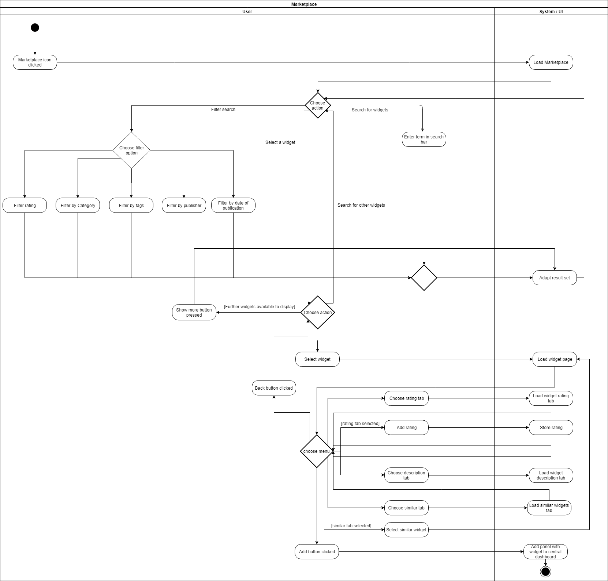
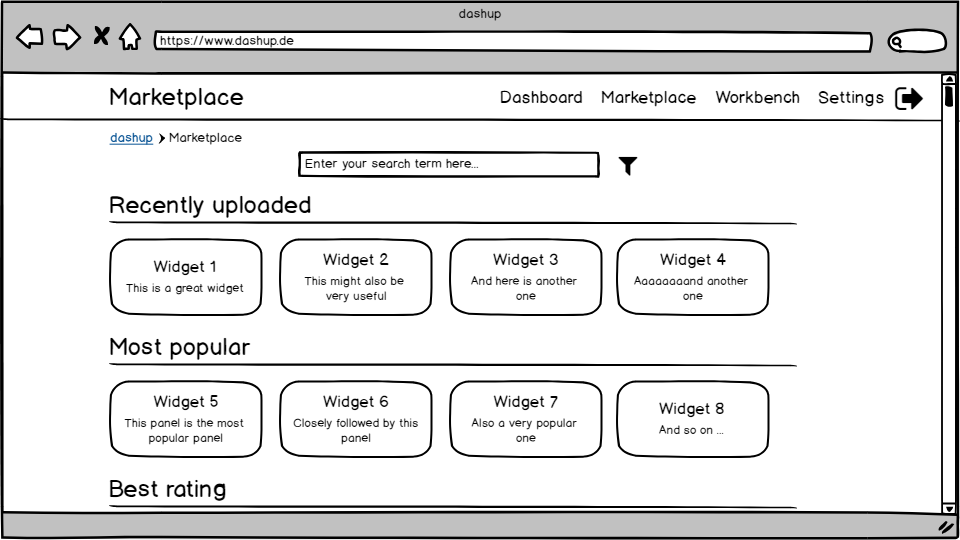
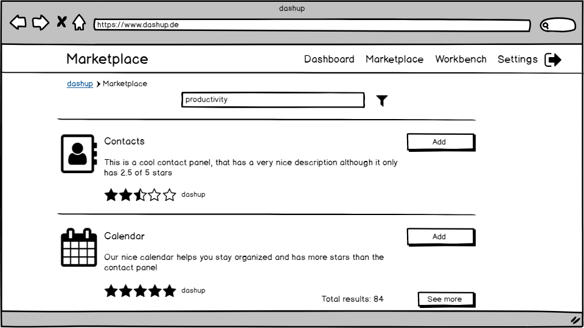
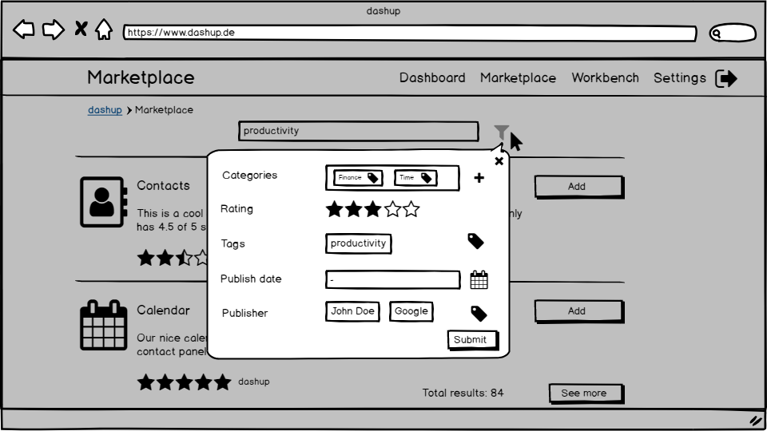
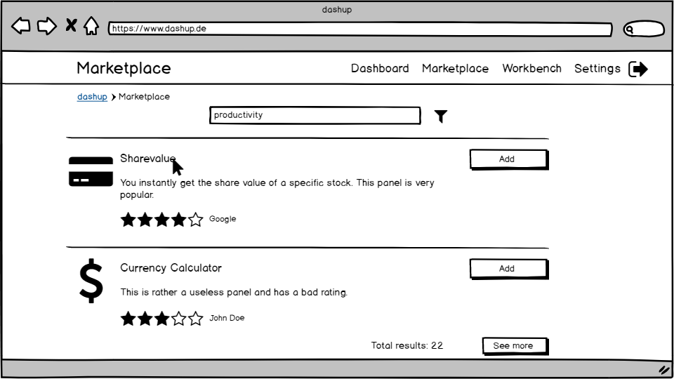
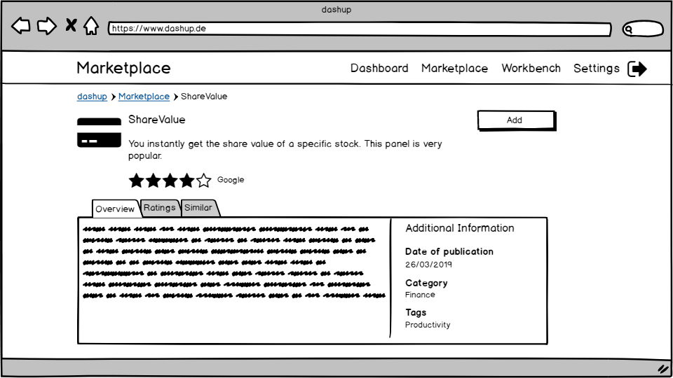
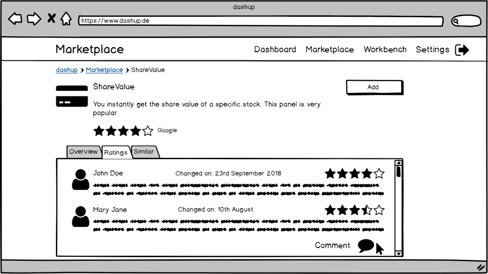
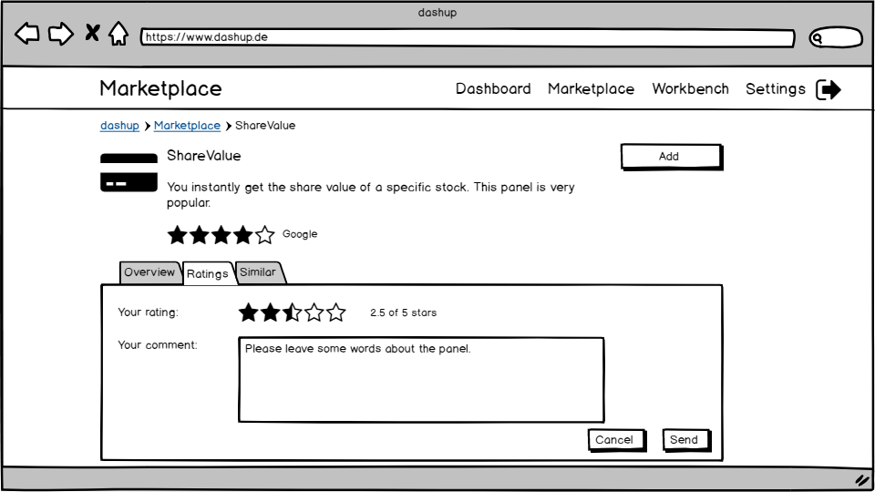
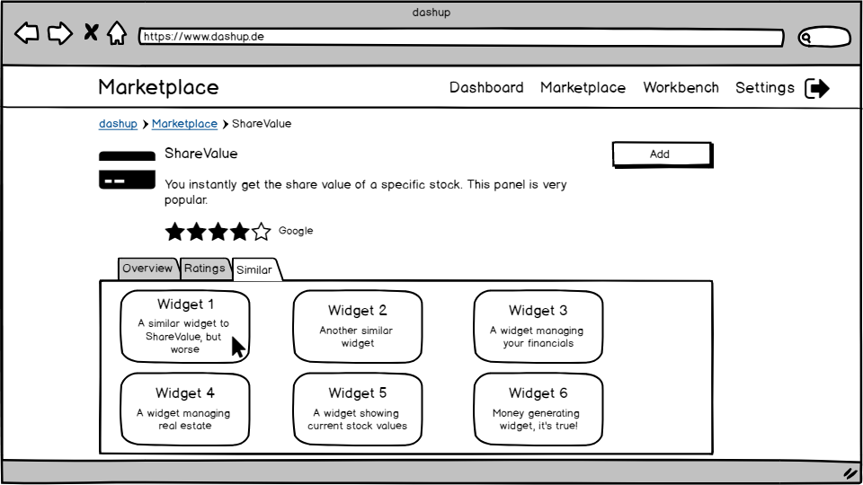
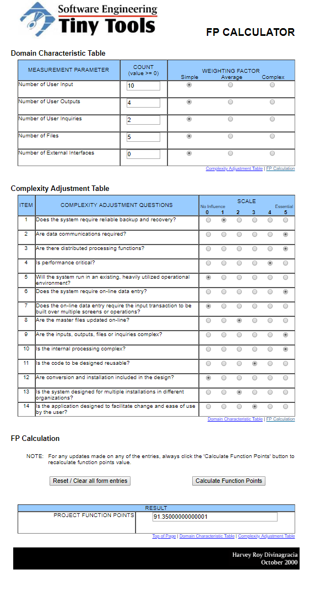

# dashup - Use Case Specification: Marketplace

### Version 2.1

# Revision History

| Date       | Version | Description                                                            | Author           |
|------------|---------|------------------------------------------------------------------------|------------------|
| 28/10/2018 | 1.0     | Initial UCS with description, activity diagram and screen flow diagram | Felix Hausberger |
| 26/03/2019 | 2.0     | Refactoring                                                            | Felix Hausberger |
| 22/04/2019 | 2.1     | Added function points estimation                                       | Felix Hausberger |

# Table Of Contents

- [Marketplace - Brief Description](#1-marketplace---brief-description) 
- [Flow Of Events](#2-flow-of-events)
    - [Basic Flow](#21-basic-flow)  
    - [Alternative Flows](#22-alternative-flows)
- [Special Requirements](#3-special-requirements)
- [Preconditions](#4-preconditions)
    - [System Atate](#41-system-state)
    - [Default Amount Of Widgets](#42-default-amount-of-widgets)
    - [Metadata Provided For Each Widget](#43-metadata-provided-for-each-widget)
- [Postconditions](#5-postconditions)
    - [Save Changed Data](#51-save-changed-data)
- [Extension Points](#6-extension-points)
- [Function Points](#7-function-points)
   
# 1. Marketplace - Brief Description
The use case _marketplace_ offers all available widgets to you. You can simply search, rate and comment on widgets. To 
find your desired widgets faster, you can set filters for the search to adapt the result set. The offered range of 
widgets reach from default widgets, that are natively available on the dashup platform, to custom user widgets, that 
were uploaded by users. A detailed view is given for each offered widget containing a description and comments about the 
widget. Furthermore, similar widgets to the current inspected widget, that other users use as well in combination with 
the current one, are displayed in a <i>similar</i> tab. As a developer it is possible to publish your own widgets to 
the marketplace from the <i>Workbench</i>. The marketplace is as well the key task point to add panels to the central 
dashboard.

# 2. Flow Of Events

## 2.1 Basic Flow

### 2.1.1 Activity Diagram

### 2.1.2 Mock-Up

 

 

 

 

 

 

 

### 2.1.3 Narrative

You can see the entire _.feature file_ right <a href="./marketplace.feature">here</a>.

## 2.2 Alternative Flows
N/A

# 3. Special Requirements
A widget can be matched to one of the following five categories:

- productivity
- lifestyle
- time
- finance
- planning

Furthermore associating widgets with tags is possible, which can be set to any value the user chooses when uploading the 
widget. When adding a widget from the marketplace, a new section will be generated in the central dashboard at the top, 
named after the widget.

# 4. Preconditions

## 4.1 System State
The user has to be signed in and must have navigated to the marketplace menu.

## 4.2 Default Amount Of Widgets
There must be at least one widget available to use the marketplace.

## 4.3 Metadata Provided For Each Widget
To properly display information about a widget, metadata such as publisherId, category etc. must be provided. Furthermore 
the publisherId must have given a detailed description about the widget to display it on the main menu in the marketplace. 
Besides a description, the widget must be associated with a category and at least one tag.

# 5. Postconditions

## 5.1 Save Changed Data
After the user has added widgets to his central dashboard, the data has to be stored. This is necessary to get a 
persistent change.

# 6. Extension Points
If enough time is left after having implemented all use cases, a feature to contact publishers or users of a widget 
could be implemented. Furthermore showing statistics of own published widgets could be another extension point.

# 7. Function Points

 

| Measurement Parameter         | DET | RET | FTR |
|-------------------------------|-----|-----|-----|
| Number of user input          | 12  | 5   | 1   |
| Number of user outputs        | 16  | 5   | 1   |
| Number of user inquiries      | 18  | 5   | 1   |
| Number of files               | 18  | 5   | 1   |
| Number of external interfaces | 0   | 0   | 0   |