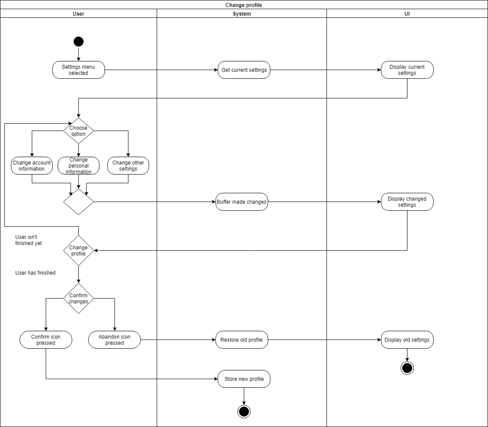
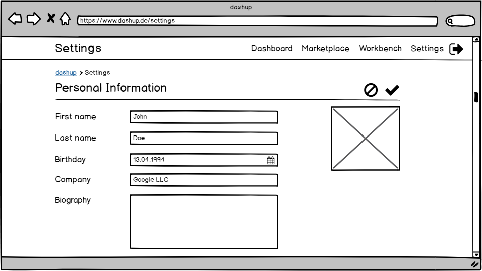

# dashup - Use Case Specification: Change Profile

### Version 2.3

# Revision History

| Date       | Version | Description                                                            | Author           |
|------------|---------|------------------------------------------------------------------------|------------------|
| 30/11/2018 | 1.0     | Added ucs and mockups                                                  | Joshua Schulz    |
| 17/03/2019 | 2.0     | Refactoring                                                            | Felix Hausberger |
| 17/03/2019 | 2.1     | Adapted process of setting a new password                              | Felix Hausberger |
| 22/04/2019 | 2.2     | Added function points estimation                                       | Felix Hausberger |
| 13/06/2019 | 2.3     | Final Updates                                                          | Felix Hausberger |

# Table Of Contents

- [Change Profile - Brief Description](#1-change-profile---brief-description) 
- [Flow Of Events](#2-flow-of-events)
    - [Basic Flow](#21-basic-flow)
    - [Alternative Flows](#22-alternative-flows)
- [Special Requirements](#3-special-requirements)
- [Preconditions](#4-preconditions)
    - [System State](#41-system-state)
- [Postconditions](#5-postconditions) 
    - [Save Changed Data](#51-save-changed-data)
    - [Discard Changed Data](#52-discard-changed-data)
- [Extension Points](#6-extension-points)
- [Function Points](#7-function-points)

# 1. Change Profile - Brief Description
In the use case _edit profile_ users can adapt personal information like name, birthday, company or the short biography 
in the <i>Settings</i> menu. Furthermore the unique username, login credentials and language settings are changeable. 

# 2. Flow Of Events

## 2.1 Basic Flow

### 2.1.1 Activity Diagram

### 2.1.2 Mock-Up

 

 

 

 

### 2.1.3 Narrative
You can see the entire _.feature file_ right <a href="./narratives/change_profile.feature">here</a>.

## 2.2 Alternative Flows
N/A

# 3. Special Requirements
When changing account settings, there must always be a unique username and e-mail address provided. Furthermore, 
passwords with less than eight characters are not tolerated. After having selected a different language, there will be a 
preview of the selected language. Supported languages are english and german.

# 4. Preconditions

## 4.1 System State
The user has to be signed in and must have navigated to the settings menu.

# 5. Postconditions

## 5.1 Save Changed Data
After the user has changed the profile settings and pressed the confirm icon, the data has to be stored. This is 
necessary to get a persistent change.

## 5.2 Discard Changed Data
If the user leaves dashup before saving the changes, the old settings will be restored.

# 6. Extension Points
If enough time is left after having implemented all use cases, maybe a possibility to add references to social media 
accounts could be added.

# 7. Function Points

 

| Measurement Parameter         | DET | RET | FTR |
|-------------------------------|-----|-----|-----|
| Number of user input          | 10  | 1   | 1   |
| Number of user outputs        | 0   | 0   | 0   |
| Number of user inquiries      | 10  | 1   | 1   |
| Number of files               | 10  | 1   | 1   |
| Number of external interfaces | 0   | 0   | 0   |