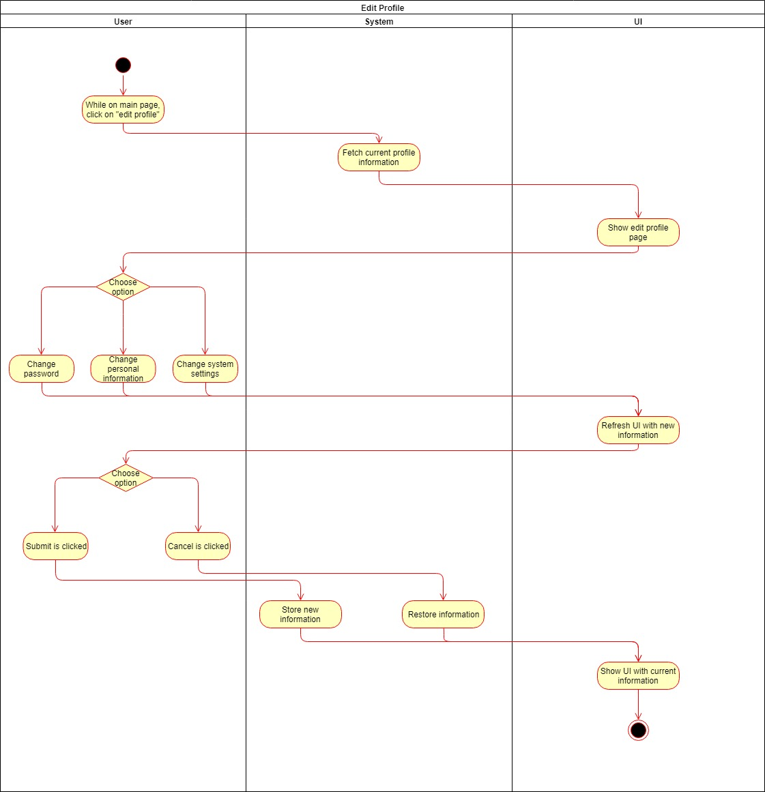
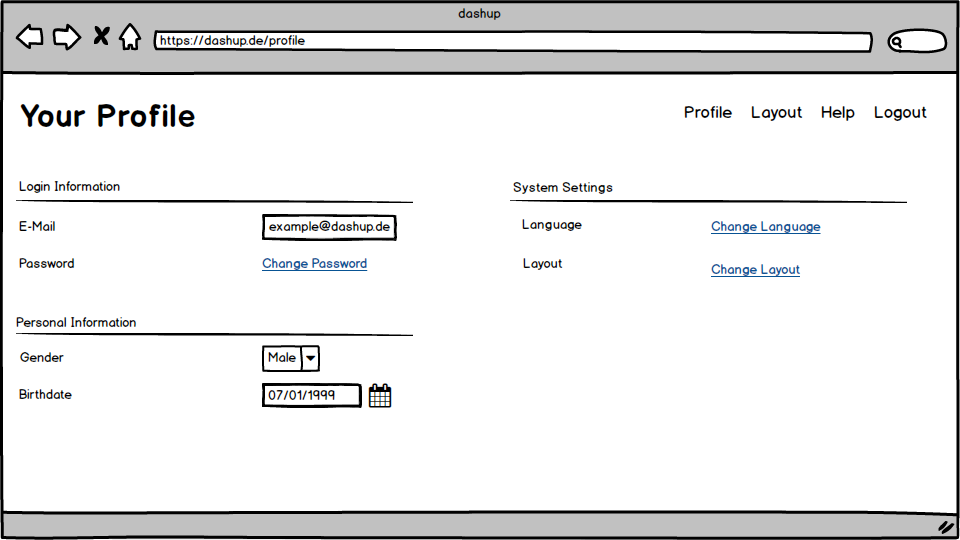

dashup - Use Case Specification: Edit profile
============================================
### Version 1.0

# Revision History

| Date       | Version | Description          | Author      |
|------------|---------|----------------------|-------------|
| 30.11.2018 |1.0      |added UCS and Mockups |Joshua Schulz|

# Table of Contents

- [Use-Case Name - Brief Description](#1-use-case-name---brief-description) 
- [Flow Of Events](#2-flow-of-events)
    - [Basic Flow](#21-basic-flow)
    - [Alternative Flows](#22-alternative-flows)
- [Special Requirements](#3-special-requirements)
    - [First Special Reqiurement](#31--first-special-requirement-)
- [Preconditions](#4-preconditions)
    - [Precondition One](#41--precondition-one-)
- [Postconditions](#5-postconditions) 
    - [Postcondition One](#51--postcondition-one-) 
- [Extension Points](#6-extension-points)
    - [Name of Extention Point](#61-name-of-extension-point)

# 1. Edit profile - Brief Description

This use case describes the functionality to change a users personal information while using dashup.
The user should be able to change his/her log in credentials and additional information such as date of birth and gender.

# 2. Flow of Events

## 2.1 Basic Flow
### 2.1.1 Activity Diagram

### 2.1.2 Mock-Up

 

 

 

### 2.1.3 Narrative
You can see the entire _.feature file_ right [here](editProfile.feature).
## 2.2 Alternative Flows
N/A

# 3. Special Requirements
There are no special requirements for this use case.
# 4. Preconditions
## 4.1 Log in / Account
The user needs to have an account and needs to be logged in with his account. Only than he/she can access the edit 
profile Page to change the information associated with the account.
# 5. Postconditions
##  5.1 Save data
After the user has made some changes the changed data needs to be stored to the database to get a persistent change.
##  5.1 Rollback data
If the user exits the edit profile page without confirming the changes the changes needs to be undone and should not be stored to the database.
# 6. Extension Points

N/A