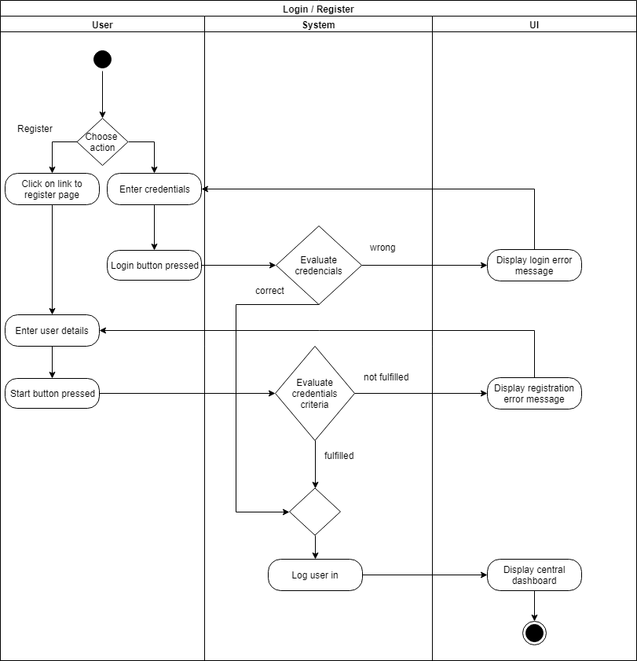
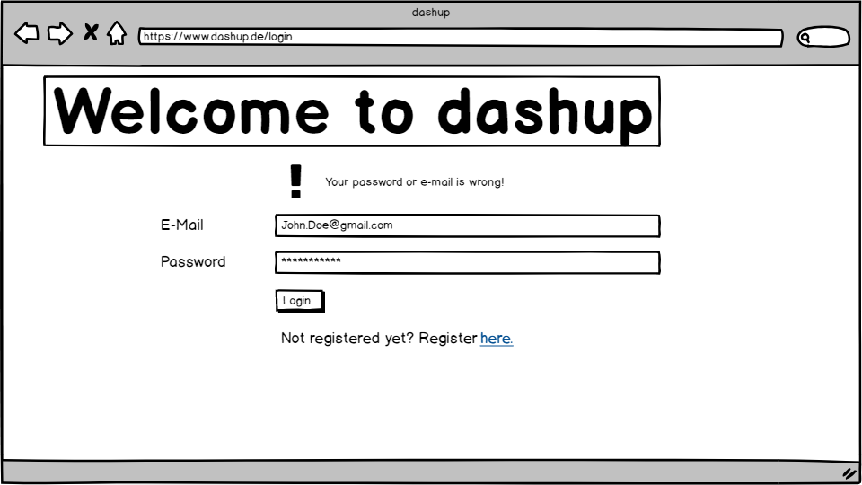
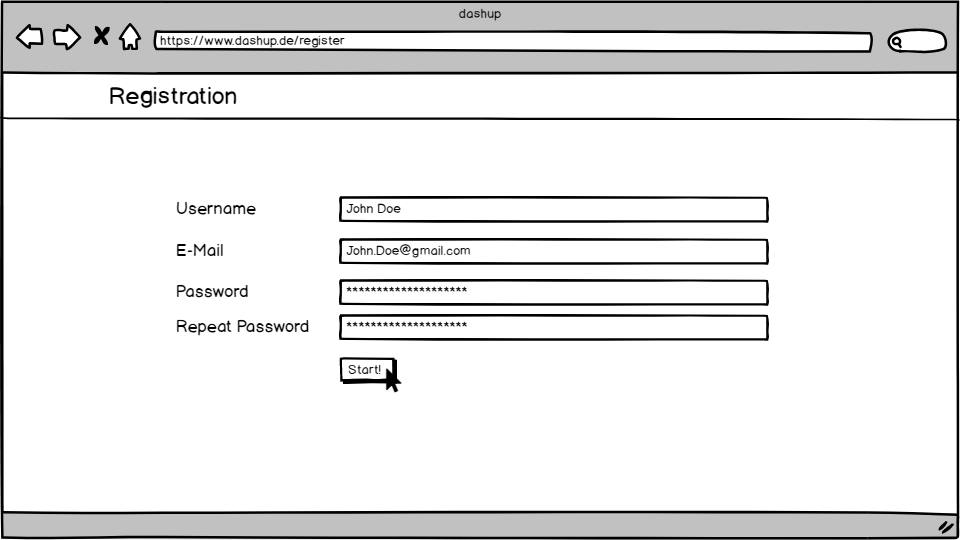
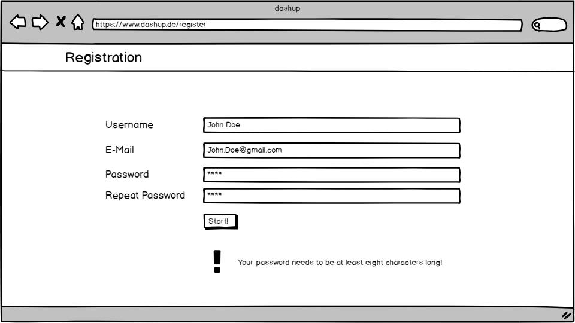
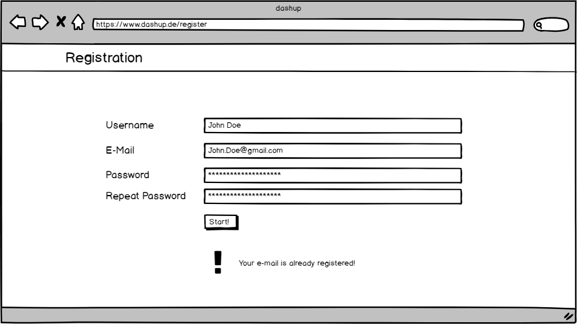

dashup - Use Case Specification: Login / Register
============================================
### Version 2.1

# Revision History

| Date       | Version | Description                                                            | Author           |
|------------|---------|------------------------------------------------------------------------|------------------|
| 11/29/2018 | 1.0     | Initial ucs with description, activity diagram and screen flow diagram | Raphael Müßeler  |
| 17/03/2019 | 2.0     | Refactoring                                                            | Felix Hausberger |
| 26/03/2019 | 2.1     | Removed authentication e-mail                                          | Felix Hausberger |

# Table of Contents

- [Login / Register - Brief Description](#1-login--register---brief-description) 
- [Flow Of Events](#2-flow-of-events)
    - [Basic Flow](#21-basic-flow)
    - [Alternative Flows](#22-alternative-flows)
- [Special Requirements](#3-special-requirements)
- [Preconditions](#4-preconditions)
    - [Registered to log in](#41-registered-to-log-in)
- [Postconditions](#5-postconditions) 
    - [Save Changed Data](#51-save-changed-data) 
    - [Navigated to central dashboard](#52-navigated-to-central-dashboard)
- [Extension Points](#6-extension-points)

# 1. Login / Register - Brief Description

In the use case _login / register_ each user is referenced by a unique e-mail address. During registration users have to 
provide a username, e-mail address and password. The password has to be repeated correctly. To log in users have to 
provide the password and e-mail address for their account and are directed to the central dashboard if all credentials 
entered are correct. Browser cookies will store user sessions, making repeated login processes redundant. 

# 2. Flow of Events

## 2.1 Basic Flow

### 2.1.1 Activity Diagram

### 2.1.2 Mock-Up

 

 

 

 

### 2.1.3 Narrative
You can see the entire _.feature file_ right <a href="./narratives/login_register.feature">here</a>.

## 2.2 Alternative Flows
N/A

# 3. Special Requirements
Every e-mail and username is used as an unique identifier. Therefore both information must be entered uniquely. 
Furthermore, every password must at least be eight characters long, regardless which characters.

# 4. Preconditions

## 4.1 Registered to log in
The user has to be registered before he can login in to dashup. 

# 5. Postconditions

## 5.1 Save Changed Data
After the user has submitted his account information, the information has to be stored. This is necessary
to enable future logins. 

## 5.2 Navigated to central dashboard
After having registered or logged in to dashup the user should be automatically navigated to the central dashboard.

# 6. Extension Points
If enough time is left after having implemented all use cases, maybe sending automated e-mails to users when account 
hijacking is suspected could be implemented. A checkbox to allow dashup to send advertisements per e-mail could as well 
be considered.

Furthermore, an additional authetication method by sending a registration e-mail containing a registration link is 
possible.