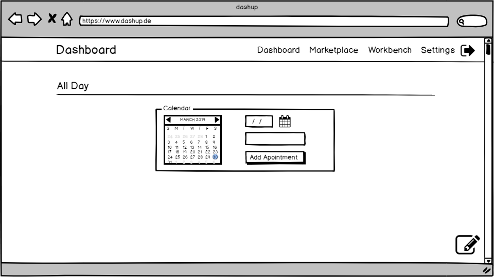
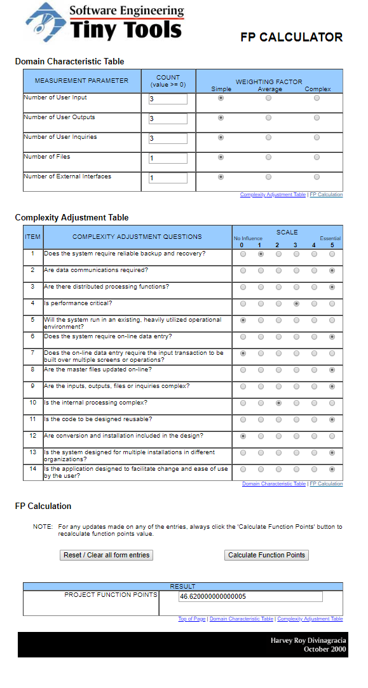

dashup - Use Case Specification: Widget
============================================
### Version 2.1

# Revision History

| Date       | Version | Description                                                            | Author           |
|------------|---------|------------------------------------------------------------------------|------------------|
| 09/12/2018 | 1.0     | Initial UCS with description, activity diagram and screen flow diagram | Felix Hausberger |
| 30/03/2019 | 2.0     | Refactoring                                                            | Felix Hausberger |
| 22/04/2019 | 2.1     | Added function points estimation                                       | Felix Hausberger |

# Table of Contents

- [Widget - Brief Description](#1-widget---brief-description) 
- [Flow Of Events](#2-flow-of-events)
    - [Basic Flow](#21-basic-flow)
    - [Alternative Flows](#22-alternative-flows)
- [Special Requirements](#3-special-requirements)
- [Preconditions](#4-preconditions)
    - [System State](#41-system-state)
    - [Widget Build Correctly](#42-widget-build-correctly)
- [Postconditions](#5-postconditions) 
- [Extension Points](#6-extension-points)
- [Function Points](#7-function-points)
 
# 1. Widget - Brief Description
Widgets describe small components, that represent the main use case of dashup. They encapsulate functionality in a small 
unit, but are only responsible for data visualization and user interaction. Any logic related to data processing behind 
a widget is outsourced to an external API. The API itself is hosted on external servers and is not part of the dashup 
software. This idea makes it possible that users can create own widgets in dashup to connect to own business logic. With 
a variety of <a href="../widgets/components">dashup web components</a> developing data visualization units or user 
interaction interfaces has never been that easy. Furthermore the widgets themselves are built as web components making 
them reusable and fast.

# 2. Flow Of Events

## 2.1 Basic Flow

### 2.1.1 Activity Diagram
As the usage of a widget differs from one to another and each widget embodies its own functionality, no basic flow chart 
can be created to summarize the usage of a widget. Sometimes widgets will just display data without any interaction with 
the user, sometimes the user can give minimum input to the widget and pass this data to an external API, which returns 
resulting data for visualization. 

### 2.1.2 Mock-Up

 

The image above gives an example of how a widget can look like. You can use the basic functionality of a widget by using 
specific interaction web components, like a dashup-button or an dashup-input field.

### 2.1.3 Narrative
The logic behind a widget for data processing is hosted on an external server and provided by its consumable web 
service. As most widgets from dashup are developed by its community and users, it is uncertain how a widget looks like 
and what its purpose is. This is why, the functionality of a widget won't get tested. The web components widgets are 
built with and their interaction with other web components will be tested in internal prototypes though. 

## 2.2 Alternative Flows
N/A

# 3. Special Requirements

## 3.1 Web Components
To ensure, that users can lateron create custom widgets, the process of creating the widgets should be made as simple as 
possible. Therefore dashup will provided predefined web components, that already embody certain behavior and 
characteristics. Each widget consists out of several web components, whereas default widgets provided by dashup are web 
component as well. Rendering of a web component takes place in the Shadow DOM of the browser, the user only has to pass 
certain attribute values to the component to male it work correctly. These attribute values are:

- name: Name of the component in order to address it uniquely
- api: Address of the API of the user, that delivers the data to display (optional)
- param: name of parameter for the API call, whose value is added by the component (optional)
- action: use "data" to fetch data or "rfc" to make a remote function call with data of the component (optional)
- consumers: components to which the response should be forwarded, in order to display the result (optional)
- producers: components to get data from to send to API (optional)

The API responses have to follow a specific JSON format. Please see the extra web components specification to get 
further details. In general the API response must contain the name of a consumer as a key to related data.

# 4. Preconditions

## 4.1 System State
The user has to be signed in and must have navigated to the dashboard menu.

## 4.2 Widget Build Correctly
To make the widget work appropriately, users must follow the instructions and information provided in the web components 
specifications.

#  5. Postconditions
N/A

#  6. Extension Points
N/A

# 7. Function Points

 

Be aware that the information on the amount of user input, output and inquiries are just average values. They should not 
exceed five for ease of use purposes.

| Measurement Parameter         | DET | RET | FTR |
|-------------------------------|-----|-----|-----|
| Number of user input          | 3   | 1   | 1   |
| Number of user outputs        | 3   | 1   | 1   |
| Number of user inquiries      | 3   | 1   | 1   |
| Number of files               | 5   | 1   | 1   |
| Number of external interfaces | 5   | 1   | 0   |