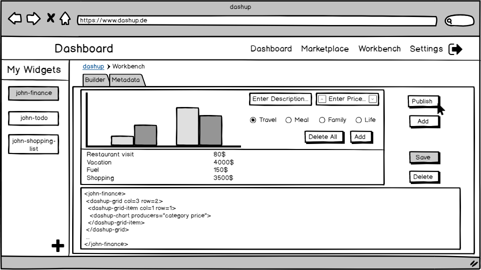
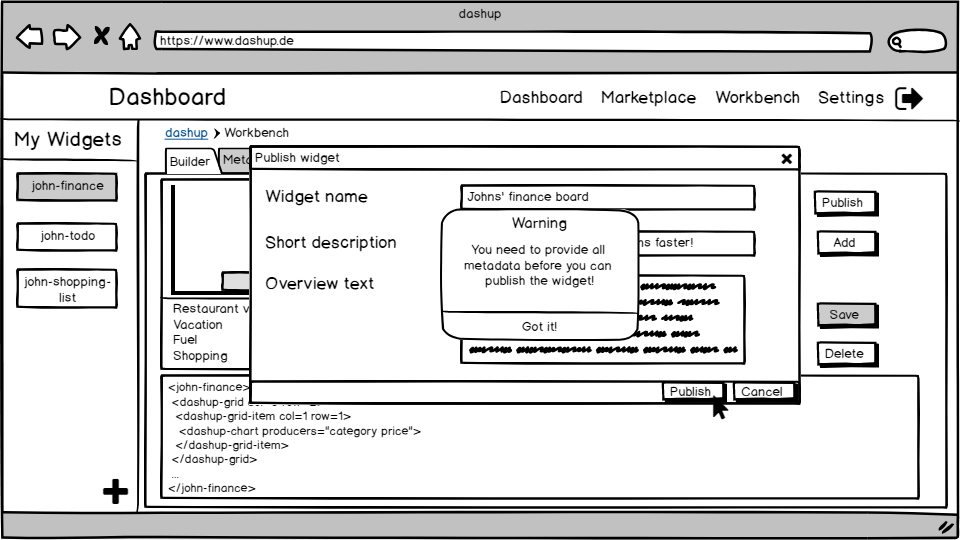

dashup - Use Case Specification: Workbench
============================================
### Version 1.1

# Revision History

| Date       | Version | Description                                                            | Author           |
|------------|---------|------------------------------------------------------------------------|------------------|
| 30/03/2018 | 1.0     | Initial ucs with description, activity diagram and screen flow diagram | Felix Hausberger |
| 22/04/2019 | 1.1     | Added function points estimation                                       | Felix Hausberger |

# Table Of Contents

- [Workbench - Brief Description](#1-workbench---brief-description) 
- [Flow Of Events](#2-flow-of-events)
    - [Basic Flow](#21-basic-flow)
    - [Alternative Flows](#22-alternative-flows)
- [Special Requirements](#3-special-requirements)
- [Preconditions](#4-preconditions)
- [Postconditions](#5-postconditions) 
- [Extension Points](#6-extension-points)
- [Function Points](#7-function-points)

# 1. Workbench - Brief Description
In the use case _workbench_ each user can create custom widgets, the extent of usage and functionality is up to the user 
himself. Note that users can only take use of dashup web components to build own custom widgets. Any program logic must 
be hosted as an external API offering RESTful services. A user has the possibility to connect such an API to the 
provided dashup web components in order to fetch data to display on the widget or to run server-side program logic. 
After the user created his widget, he has the possibility to publish the widget to the dashup marketplace. Therefore he 
needs to provide several metadata including widget name, short description, overview text, widget category and at least 
one tag as well as a username in the account settings menu. Furthermore the user can add his own widget to his central 
dashboard independent from having it published. If users wish to delete a custom widget, it gets deleted from the 
marketplace as well, if published.

# 2. Flow of Events

## 2.1 Basic Flow

### 2.1.1 Activity Diagram

### 2.1.2 Mock-Up

 

 

 

 

 

 

 

 

### 2.1.3 Narrative
You can see the entire _.feature file_ right <a href="./narratives/workbench.feature">here</a>.

## 2.2 Alternative Flows
N/A

# 3. Special Requirements
When creating a new custom widget the user can choose between several widget templates, specified 
<a href="/docs/specifications/ucs/widgets/templates">here</a>. If the user unfocuses the editor panel, a preview of the 
custom widget will be displayed. Furthermore all metadata as well as a username must be provided in order to publish a 
widget to the marketplace. The categories match to the defined categories in the marketplace specification. When adding 
a widget from the workbench, a new section will be generated in the central dashboard at the top, named after the 
widget. No metadata is needed in order to add widgets to ones own central dashboard.

# 4. Preconditions

## 4.1 System State
The user has to be signed in and must have navigated to the workbench menu.

## 4.2 Developer Role
The user should have a basic understanding of HTML5 and should have read the documentation of dashup web components in 
order to develop a widget.

# 5. Postconditions

## 5.1 Save Changed Data
After the user has developed a widget and provided the metadata, the data has to be stored. This is necessary to publish 
a widget or to add it to the central dashboard. 

# 6. Extension Points
If enough time is left after having implemented all use cases, implementing a syntax and sematics check for the editor 
panel could be considered.

# 7. Function Points

 

| Measurement Parameter         | DET | RET | FTR |
|-------------------------------|-----|-----|-----|
| Number of user input          | 10  | 3   | 1   |
| Number of user outputs        | 3   | 1   | 0   |
| Number of user inquiries      | 12  | 3   | 1   |
| Number of files               | 12  | 3   | 1   |
| Number of external interfaces | 0   | 0   | 0   |