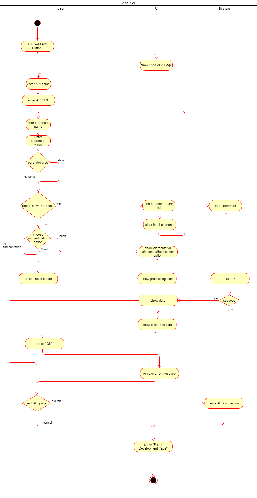

dashup - Use Case Specification: Add API
============================================
### Version 1.0

# Revision History

| Date       | Version | Description                                                            | Author           |
|------------|---------|------------------------------------------------------------------------|------------------|
| 11/11/2018 | 1.0     | Initial UCS with description, activity diagram and screen flow diagram | Sven Leonhard    |

# Table of Contents

- [Add API - Brief Description](#1-marketplace---brief-description) 
- [Flow Of Events](#2-flow-of-events)
    - [Basic Flow](#21-basic-flow)  
    - [Alternative Flows](#22-alternative-flows)
- [Special Requirements](#3-special-requirements)
- [Preconditions](#4-preconditions)
    - [Logged in to dashup](#41-logged-in-to-dashup)
- [Postconditions](#5-postconditions) 
- [Extension Points](#6-extension-points)
   
# 1. Add API - Brief description
A user (developer) has the possibility to connect an API to his self created or chosen panel in order to fetch data of a microservice 
from a server and display them within his custom panel on dashup. 
Therefore a new API has to be added to the system. The use case _add_api_ is about adding such an API. Therefore information like 
URL, name and credentials has to be entered by a user. It will only be possible to add valid APIs and so a test is required 
before adding the API can be finished. (Use Case: <a href="../ucs/custom_panel/add_api/UCS_add_api.md">Add API</a>)

# 2. Flow of Events

## 2.1 Basic Flow

### 2.1.1 Activity Diagram

### 2.1.2 Mock-Up

 

 

 

 

 

### 2.1.3 Narrative

N/A

## 2.2 Alternative Flows
N/A

# 3. Special Requirements
In order to add an API, the information for a successful connection must be available. This includes the URL, in most cases parameters, authentication type and possibly credentials. 

# 4. Preconditions

## 4.1 Logged in to dashup
Before this use case can be performed the user has to be logged in.

# 5. Postconditions
After adding a new API the access data have to be stored in the database. 

# 6. Extension Points
N/A