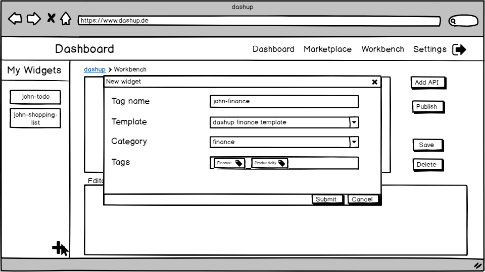
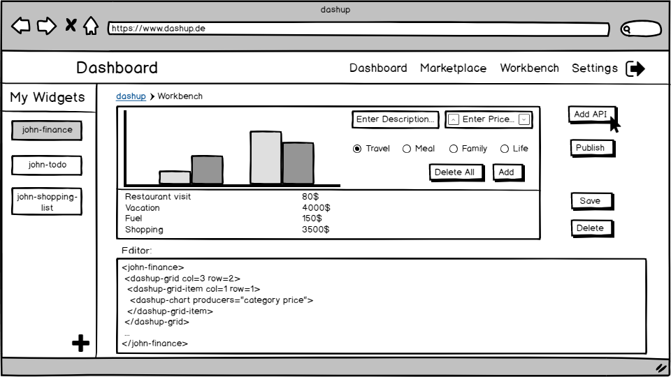
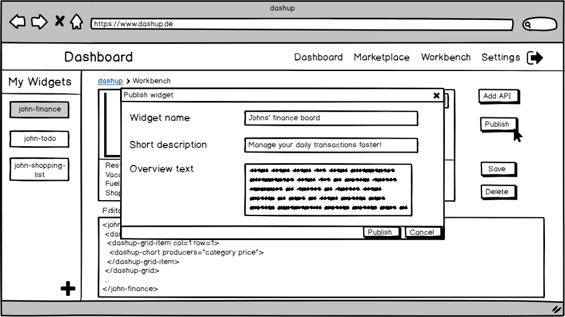
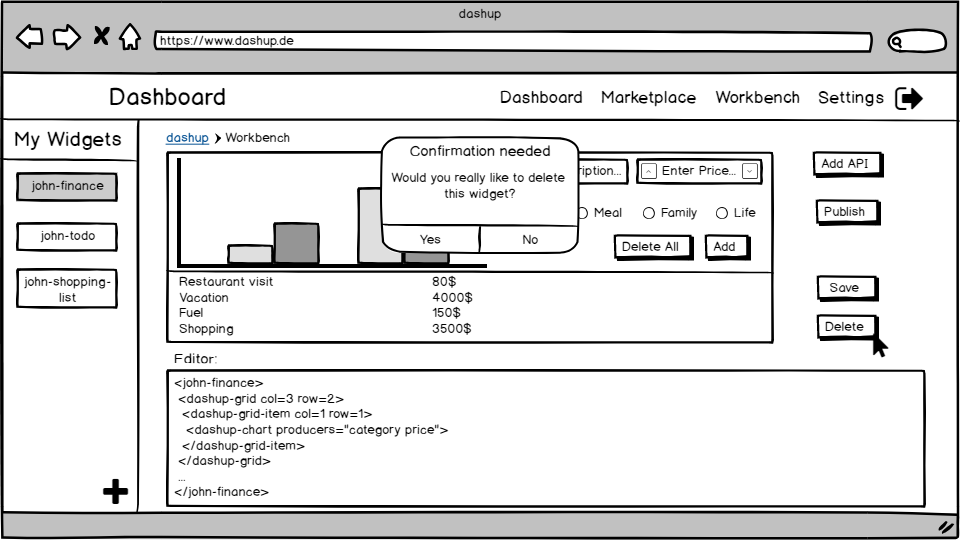

dashup - Use Case Specification: Login / Register
============================================
### Version 2.1

# Revision History

| Date       | Version | Description                                                            | Author           |
|------------|---------|------------------------------------------------------------------------|------------------|
| 28/03/2018 | 1.0     | Initial ucs with description, activity diagram and screen flow diagram | Felix Hausberger |

# Table of Contents

- [Login / Register - Brief Description](#1-login--register---brief-description) 
- [Flow Of Events](#2-flow-of-events)
    - [Basic Flow](#21-basic-flow)
    - [Alternative Flows](#22-alternative-flows)
- [Special Requirements](#3-special-requirements)
- [Preconditions](#4-preconditions)
    - [Registered to log in](#41-registered-to-log-in)
- [Postconditions](#5-postconditions) 
    - [Save Changed Data](#51-save-changed-data) 
    - [Navigated to central dashboard](#52-navigated-to-central-dashboard)
- [Extension Points](#6-extension-points)

# 1. Login / Register - Brief Description

# 2. Flow of Events

## 2.1 Basic Flow

### 2.1.1 Activity Diagram

### 2.1.2 Mock-Up

 

 

 

 

### 2.1.3 Narrative
You can see the entire _.feature file_ right <a href="./narratives/develop_widget.feature">here</a>.

## 2.2 Alternative Flows

# 3. Special Requirements

# 4. Preconditions

# 5. Postconditions

# 6. Extension Points