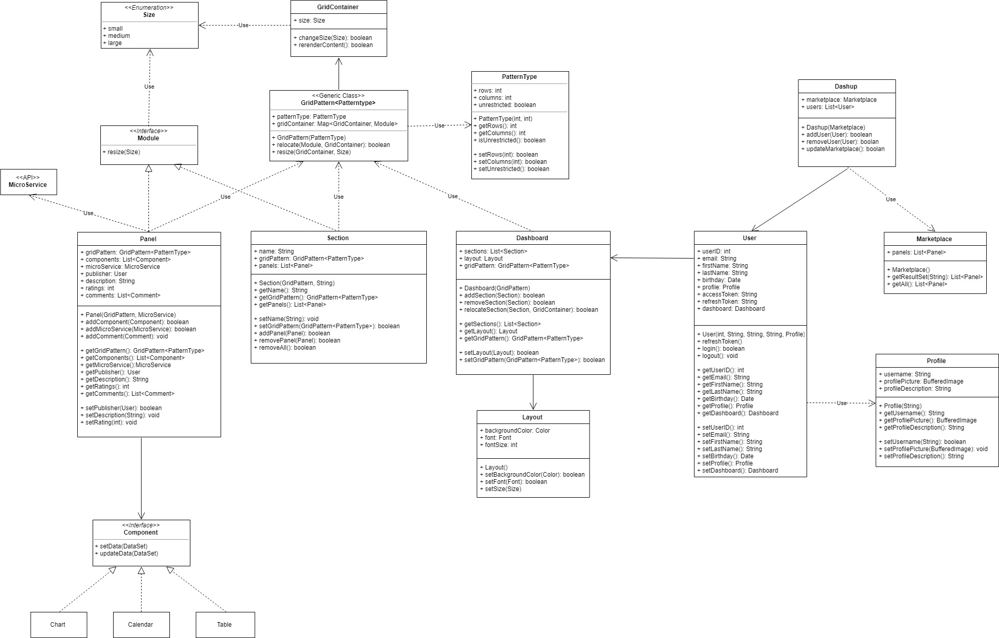
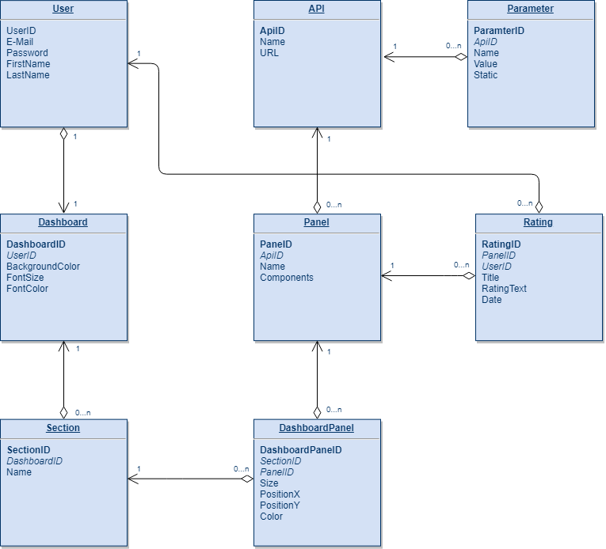

dashup - Software Requirements Specification
============================================
### Version 1.1

# Revision history

| Date       | Version | Description                                          | Author           |
|------------|---------|------------------------------------------------------|------------------|
| 21/10/2018 | 1.0     | Initial Specification                                | Felix Hausberger |
| 28/10/2018 | 1.1     | Functionality: Marketplace and Layout                | Sven Leonhard    |
| 14/11/2018 | 1.3     | System Architecture                                  | Felix Hausberger |

# Table of Contents

- [Introduction](#1-introduction)        
    - [Purpose](#11-purpose)
    - [Scope](#12-scope)
    - [Definitions, Acronyms and Abbreviations](#13-definitions-acronyms-and-abbreviations)
    - [References](#14-references)
    - [Overview](#15-overview)
 - [Overall Description](#2-overall-description)
    - [Project Vision](#21-project-vision)
    - [General Use Case Diagram](#22-general-use-case-diagram)
 - [Specific Requirements](#3-specific-requirements)
    - [Functionality](#31-functionality)
    <!--- - [Functional Requirement One](#311-functional-requirement-one)-->
    - [System Architecture](#32-system-architecture)
    - [Usability](#33-usability) 
    <!--- - [Usability Requirement One](#331-usability-requirement-one)-->
    - [Reliability](#34-reliability)
    - [Performance](#35-performance)
    <!--- [Response Time](#351-response-time)-->
    <!--- - [Throughput](#352-throughput)-->
    <!--- - [Capacity](#353-capacity)-->
    <!--- [Degradation Modes](#354-degradation-modes)-->
    <!--- [Resource Utilization](#355-resource-utilization) -->
    - [Supportability](#36-supportability)
    <!--- - [Standards and Conventions](#361-standards-and-conventions)
    <!--- [Class Libraries](#362-class-libraries)-->
    <!--- - [Maintenance](#362-maintenance)-->
    - [Design Constraints](#37-design-constraints)
    <!--- [Software Languages](#371-software-languages)-->
    <!--- [Software Process Requirements](#372-software-process-requirements)-->
    <!--- - [Developmental tools](#372-developmental-tools)-->
    <!--- - [Architectural Constraints](#372-architectural-constraints)-->
    - [On-line User Documentation and Help System Requirements](#38-on-line-user-documentation-and-help-system-requirements)
    - [Purchased Components](#39-purchased-components)
    - [Interfaces](#310-interfaces)
    <!--- - [User Interfaces](#3101-user-interfaces)-->
    <!--- - [Hardware Interfaces](#3102-hardware-interfaces)-->
    <!--- - [Software Interfaces](#3103-software-interfaces)-->
    <!--- - [Communications Interfaces](#3104-communications-interfaces)-->
    - [Licensing Requirements](#311-licensing-requirements)-->
    - [Legal, Copyright, and Other Notices](#312-legal-copyright-and-other-notices)-->
    - [Applicable Standards](#313-applicable-standards)-->
 - [Supporting Information](#4-supporting-information)  

 

# Software Requirements Specification

 

# 1. Introduction

## 1.1 Purpose
This Software Requirements Specification was created to collect and organize the requirements for the dashup platform.
Agreeing on a general consent between the developer teams expertise and the clients interests and expectations, the 
specification contains all realistic requirements, that are compatible with the projects vision. Therefore it describes 
the expected functional and nonfunctional requirements of the platform and makes it transparent to the community, who can 
therefore gain a better overview over the projects scope. Furthermore it is needed to evaluate the results of the project 
after its status is considered to be completed and ready for transition. 

## 1.2 Scope
The dashup platform provides a quick overview of multiple microservices hosted on external servers of different providers.
Therefore users no longer have to access microservices on separated ways and can gain quick insights into real time data 
of different microservices on one central platform. Furthermore, dashup provides a compressed pool of functionalities for each
microservice. Dashup is therefore considered to be a productivity tool, running as a web-application on modern browsers.
Each microservice will be displayed on the central dashboard by its individual panel containing different components for 
data visualization. Whereas users are provided with a collection of default microservices at the beginning, they can later 
enhance their dashboard with further microservices from the dashup store. In addition, there should be the possibility to 
integrate own microservices as customly defined panels to keep track of all of one's own applications.     

## 1.3 Definitions, Acronyms and Abbreviations

| Definition | Description                                                                    |
|------------|--------------------------------------------------------------------------------|
| dashup     | The official name of the project and the software                              |
| Spring MVC | A java based Model View Control Framework, the architecture used behind dashup |

 

| Abbreviation | Explanation                         |
|--------------|-------------------------------------|
| SRS          | Software Requirements Specification |
| UC           | Use Case                            |
| UCD          | Use Case Diagram                    |
| N/A          | Not Applicable                      |
| TBD          | To Be Determined                    |
| MTBF         | Mean Time Between Failures          |
| MTTR         | Mean Time To Recover                |
| IDE          | Integrated Development Environment  |
| MVC          | Model View Control                  |
| FAQ          | Frequently Asked Questions          |
| HTTP         | Hypertext Transfer Protocol         |
| HTTPS        | Hypertext Transfer Protocol Secure  |

## 1.4 References

| Reference                                                                             | Date       |
|---------------------------------------------------------------------------------------|------------|
| <a href="https://dashup2k18.wordpress.com/"> Dashup Blog </a>                         | 21/10/2018 |
| <a href="https://github.com/raphaelmue/dashup"> GitHub Repository </a>                | 21/10/2018 |
| <a href="https://youtrack.dashup.de/issues"> YouTrack </a> | 21/10/2018 |

## 1.5 Overview
In the next chapter, the general vision as well as the UCD will be provided, in order to give a quick summary about the 
scope of the project. The more in depth specification of the project will follow in the chapter <i>Specific Requirements</i>.
Every feature that dashup provides, will be described and explained in chapter <i>Functionality</i> going over to <i>Usability</i>
and <i>Reliability</i> claims of dashup. Furthermore, <i>Performance</i>, <i>Supportability</i> and <i>Design constraints</i> 
will be a part of the specification, giving information about our service level agreements. In order to meet the expectations 
of basic users and developers, <i>Documentation and Help System Requirements</i> will also play a big role within this SRS. 
<i>Purchased components</i>, <i>hardware interfaces</i> as well as <i>Licensing Requirements</i> 
are minor topics or not applicable for the dashup project and will therefore not be a part of this specification. Other 
interfaces like <i> User-, Software- and Communication-Interfaces</i> on the other hand, will be described in chapter 
<i>Interfaces</i>. To finish of the specification, the <i>Legal, Copyright, and Other</i> chapter as well as <i>Applicable Standards</i> 
offer insights in our coding creeds and the allowed range of usage of our application. If any questions are left open or 
an adaption of the SRS in needed, please contact one of the developers listed in <i>Further information</i>.

# 2 Overall Description

## 2.1 Project Vision
In today's digital world, automation is everything. To keep up with modern achievement-oriented society, people need to 
accomplish daily tasks and planning more efficiently. Therefore people are used to create multiple personal productivity tools. 
Keeping an overview over your own pool of applications might occur difficult sometimes. Inspired by this efficiency loss, 
we will create dashup to give you the ultimate tool to get back on track again.

Dashup helps you to get through daily tasks easier by providing various microservices for typical private usage scenarios on a central platform. 
By fetching relevant information of each microservice, dashup saves you from spending too much time on analyzing data or 
using applications. You can take use of each microservice restricted to the essential set of features or get insights into 
real time processed data quickly , thus leading to more efficiency. Each microservice will be displayed as its own panel 
on the central dashboard. 

Additionally, dashup gives you the opportunity to create custom panels for your own microservices and to publish 
your panel for global usage.

All in all, dashup will provide you the best experience and overview over all daily productivity tools on a central platform.

## 2.2 General Use Case Diagram
Following UCD will provide a basic overview to the user characteristics, features, constraints, associations and dependencies 
within the project scope. Furthermore, non-functional requirements are put outside the system boundaries.
 
 

# 3 Specific Requirements

## 3.1 Functionality

### 3.1.1 Main Overview
When opening dashup in your browser, the microservices should display all relevant information graphically or textually 
and they are presented as panels. You can easily customize the panel by e.g. changing the background color and reordering 
or resizing the panels. Besides you can also create and modify sections in order to structure your dashup. 

### 3.1.2 Marketplace
In the marketplace all available panels for microservices are offered to you.
You can simply search for panels, filter the result set, rate and comment on panels. Some panels for microservices provide a basic functionality 
so that you can easily interact with it.
There is even a detailed view about each offered panel containing a description and comments about the panel.
Furthermore, similar panels to the current inspected panel, that other users use as well in combination with the current one, 
are displayed in a "similar" tab.

As a developer it is possible to publish your own panels for microservices as well as taking a look at the usage statistics of your
own microservices.
(Use Case: <a href="../ucs/marketplace/UCS_marketplace.md">Marketplace</a>)

### 3.1.3 User Management
TBD

### 3.1.4 Layout
The platform should enable the user to create, name and delete new sections and fill these sections with the desired panels. 
A rearrangement of sections as well as panels should be possible by drag and drop. 
Panels can be moved between sections and resized between small, medium or large. 
(Use Case: <a href="../ucs/layout/change_panelStructure/UCS_change_panelStructure.md">Change Panel Structure</a>)

The user can also change the layout of his personal dashboard, e.g. the background color or font. 
These settings can be changed in a little layout menu. 
(Use Case: <a href="../ucs/layout/change_layout/UCS_change_layout.md">Change Layout</a>)

### 3.1.5 Panels
TBD

### 3.1.6 Custom Panels
TBD

## 3.2 System Architecture

## 3.2.1 Class Diagram

## 3.2.2 Database Scheme

## 3.3 Usability
The motivation for the whole project is to increase the productivity, which requires usability. When opening dashup, you 
should be given an overview of all your microservices, so that you do not have to open each application. 

### 3.3.1 Start and go
Without clicking any button or similar, each microservice shows its relevant information. Each microservice fetches 
the data from its specified API automatically. Besides, if you have been logged in once on your device, you will be 
automatically logged in without doing anything. 

### 3.3.2 Clarity
All your panels should be showing only the relevant information to keep clarity. This applies also for the marketplace. 

### 3.3.3 Easy to use 
In all use cases it ought to be possible to do an action with only a few clicks. Furthermore gestures like drag and drop 
should facilitate the user. 

## 3.4 Reliability

### 3.4.1 Availability
The dashup platform should be always available. Since bugs can lead to a crash, we assume that dashup has an up-time of 
99.5% per month.

The MTBF should not fall below a number of 7 day. However, the MTTR should not exceed a number of 12 hours. 

### 3.4.2 Accuracy
Since we review our code, the defect rate should be about 10 bugs per 1.000 lines of code. Critical bugs like loss of data,
or limitations within functionality should of course occur less. Minor bugs are for instance the incorrect display of data. 
Significant bugs are e.g. no sufficient consistency check or similar. 

## 3.5 Performance

### 3.5.1 Response Time
The response time should be as low as possible. The reload of the page may not take longer than 5 seconds and in average a 
response time of 3 seconds is acceptable. Therefore the backend should keep up graphic elements like the panels to avoid 
too large computing effort if there is a high number of panels mandated on the dashboard of a user.

### 3.5.2 Throughput
The information displayed on the different panels showed in the dashboard should be reloaded every 10ms. Because of the 
provision of these data by foreign APIs and servers the fetching process could take longer. To prevent such a scenario 
corresponding conventions and rules must be introduced.

### 3.5.3 Capacity
The dashboard has to be designed for a large number of users. An increase of new members should not slow down the system in the same way.

<!--### 3.5.4 Degradation Modes -->

<!--### 3.5.5 Resource Utilization--> 

## 3.6 Supportability

### 3.6.1 Standards and Conventions
To ensure a clear structure within the project the latest clean code standards have to be applied. In addition, it is only 
allowed to use self-descriptive expressions for naming. Classes have to begin wih an upper-case, variables with a lower-case.

### 3.6.2 Maintenance
For optimal results, the use of tools for automated testing is essential. Furthermore, every line of code has to be reviewed 
to ensure compliance with the previously defined conventions.

<!--### 3.6.3 Class Libraries-->

## 3.7 Design Constraints

<!--### 3.7.1 Software Languages-->

<!--### 3.7.2 Software Process Requirements-->

### 3.7.1 Developmental tools
The main IDE will be IntelliJ IDEA. More tools are TBD.

### 3.7.2 Architectural Constraints
The project must be based on the MVC architecture. Therefore the Spring Framework will be in use.  
Furthermore it should not be possible to upload executable code to dashup servers.

## 3.8 On-line User Documentation and Help System Requirements
The application should be kept as simple that detailed introduction into the service is superfluous. To provide fast support 
for standard questions a FAQ will be set up. For developers of custom panels a documentation including a tutorial should be available. 

## 3.9 Purchased Components
On the hardware side there will be rent a virtual server. Except the domain which also is a purchased component there are 
open source or free available components allowed for use only. As a consequence the dashup project on itself has to be licensed 
under an open source license to avoid conflicts with the owner of software or visual components. 

## 3.10 Interfaces

### 3.10.1 User Interfaces
* **Login screen** that provides input fields to login.
* **Registration screen** where he user can set up an new account.
* **Main dashboard** on which the user can see all his panels and the information provided by the microservices.
* **Profile management screen** where a user can edit and update her/his personal information.
* **Marketplace** where default and custom microservices can be found and added to own dashboard.
* **Panel editor** on which developers can create their own panels to display information from their own microservices. 

### 3.10.2 Hardware Interfaces
N/A

### 3.10.3 Software Interfaces
The dashup application runs in a web-browser. We will try to make it work in many different web-browsers as possible.

### 3.10.4 Communications Interfaces
The webapplication should communicate with the java backend by a secured HTTPS connection on Port 443. If there should 
be a unencrypted connection via HTTP is still to be determined. The Connection should be asynchronous to avoid a reload 
of the webapplication.   

## 3.11 Licensing Requirements
TBD

## 3.12 Legal, Copyright, and Other Notices
The dashup team will not take any responsibility for lost data and other damages done to your microservice or other programs. 
The dashup logo may only be used for the official dashup application. The copy of the idea or any kind of coding belonging 
to the dashup application is strictly forbidden and will be taken to court.

## 3.13 Applicable Standards
The code of dashup should follow some basic rules of clean code such as:
* Intuitive names of variables and methods.
* Comments to improve understanding and readability of the code.
* Design patterns integration.
* No hard-coded strings.
* No premature optimization.
* Secure transfer of data

If necessary there can be exceptions to this rules, but they have to be well considered and discussed.

# 4 Supporting Information
**For more information please contact:**
* <a href="mailto:felix.hausberger@t-online.de"> Felix Hausberger </a>
* <a href="mailto:sven.leonhard@7lofficial.de"> Sven Leonhard </a>
* <a href="mailto:raphael.muesseler@sap.com"> Raphael Müßeler </a>
* <a href="mailto:joshua.schulz@sap.com"> Joshua Schulz </a>

