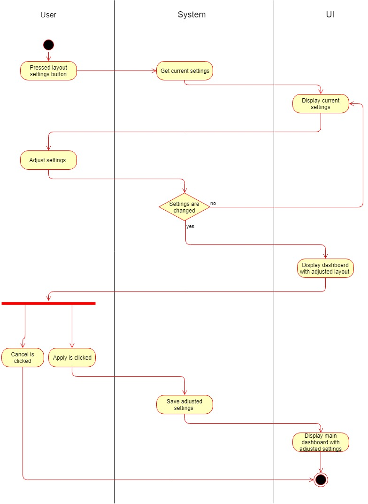

dashup

Use Case Specification: **Change layout of main dashboard**

#Revision History

<table border="1" cellspacing="0" cellpadding="0" style="border-collapse:collapse;
 border:none;">

<tbody>

<tr>

<td width="154" valign="top" style="width:1.6in;border:solid windowtext .75pt;
  padding:0in 5.4pt 0in 5.4pt">

**Date**

</td>

<td width="77" valign="top" style="width:.8in;border:solid windowtext .75pt;
  border-left:none;padding:0in 5.4pt 0in 5.4pt">

**Version**

</td>

<td width="250" valign="top" style="width:2.6in;border:solid windowtext .75pt;
  border-left:none;padding:0in 5.4pt 0in 5.4pt">

**Description**

</td>

<td width="154" valign="top" style="width:1.6in;border:solid windowtext .75pt;
  border-left:none;padding:0in 5.4pt 0in 5.4pt">

**Author**

</td>

</tr>

<tr>

<td width="154" valign="top" style="width:1.6in;border:solid windowtext .75pt;
  border-top:none;padding:0in 5.4pt 0in 5.4pt">

28.10.2018

</td>

<td width="77" valign="top" style="width:.8in;border-top:none;border-left:none;
  border-bottom:solid windowtext .75pt;border-right:solid windowtext .75pt;
  padding:0in 5.4pt 0in 5.4pt">

1.0

</td>

<td width="250" valign="top" style="width:2.6in;border-top:none;border-left:none;
  border-bottom:solid windowtext .75pt;border-right:solid windowtext .75pt;
  padding:0in 5.4pt 0in 5.4pt">

initial UCS with basic information

</td>

<td width="154" valign="top" style="width:1.6in;border-top:none;border-left:none;
  border-bottom:solid windowtext .75pt;border-right:solid windowtext .75pt;
  padding:0in 5.4pt 0in 5.4pt">

Joshua Schulz

</td>

</tr>

<tr>

<td width="154" valign="top" style="width:1.6in;border:solid windowtext .75pt;
  border-top:none;padding:0in 5.4pt 0in 5.4pt"></td>

<td width="77" valign="top" style="width:.8in;border-top:none;border-left:none;
  border-bottom:solid windowtext .75pt;border-right:solid windowtext .75pt;
  padding:0in 5.4pt 0in 5.4pt"></td>

<td width="250" valign="top" style="width:2.6in;border-top:none;border-left:none;
  border-bottom:solid windowtext .75pt;border-right:solid windowtext .75pt;
  padding:0in 5.4pt 0in 5.4pt"></td>

<td width="154" valign="top" style="width:1.6in;border-top:none;border-left:none;
  border-bottom:solid windowtext .75pt;border-right:solid windowtext .75pt;
  padding:0in 5.4pt 0in 5.4pt"></td>

</tr>

<tr>

<td width="154" valign="top" style="width:1.6in;border:solid windowtext .75pt;
  border-top:none;padding:0in 5.4pt 0in 5.4pt"></td>

<td width="77" valign="top" style="width:.8in;border-top:none;border-left:none;
  border-bottom:solid windowtext .75pt;border-right:solid windowtext .75pt;
  padding:0in 5.4pt 0in 5.4pt"></td>

<td width="250" valign="top" style="width:2.6in;border-top:none;border-left:none;
  border-bottom:solid windowtext .75pt;border-right:solid windowtext .75pt;
  padding:0in 5.4pt 0in 5.4pt"></td>

<td width="154" valign="top" style="width:1.6in;border-top:none;border-left:none;
  border-bottom:solid windowtext .75pt;border-right:solid windowtext .75pt;
  padding:0in 5.4pt 0in 5.4pt"></td>

</tr>

<tr>

<td width="154" valign="top" style="width:1.6in;border:solid windowtext .75pt;
  border-top:none;padding:0in 5.4pt 0in 5.4pt"></td>

<td width="77" valign="top" style="width:.8in;border-top:none;border-left:none;
  border-bottom:solid windowtext .75pt;border-right:solid windowtext .75pt;
  padding:0in 5.4pt 0in 5.4pt"></td>

<td width="250" valign="top" style="width:2.6in;border-top:none;border-left:none;
  border-bottom:solid windowtext .75pt;border-right:solid windowtext .75pt;
  padding:0in 5.4pt 0in 5.4pt"></td>

<td width="154" valign="top" style="width:1.6in;border-top:none;border-left:none;
  border-bottom:solid windowtext .75pt;border-right:solid windowtext .75pt;
  padding:0in 5.4pt 0in 5.4pt"></td>

</tr>

</tbody>

</table>

**  
**

Table of Contents

- [Change general layout](#1-change-general-layout) 

- [Flow of Events](#flow-of-events)

    - [Basic Flow](#basic-flow)   

    - [Alternative Flows](#alternative-flows)

- [Special Requirements](#special-requirements)

- [Preconditions](#preconditions)

    - [System State](#system-state)

- [Postconditions](#postconditions) 
    
    - [Save changed data](#save-changed-data)

- [Extension Points](#extension-points)

Use-Case Specification: <Use-Case Name>

# 1. Change general layout

## 1.1 Brief Description

This use-case allows to user to change the layout and the arrangement of sections and panels on his/her
personal dashboard. First the user should be able to change basic layouts of the board, e.g. the main color or 
font. These settings can be changed in a little layout menu. 
 
Second the platform should enable the user to create and name new sections and fill these sections by the panels he/she likes. 
Furthermore it should be possible to delete sections. A rearrangement of panels should be possible by drag and drop. 
Panels can be moved between sections.   

# Flow of Events

## Basic Flow

### 2.1.1 Activity Diagram

### 2.1.2 Mock-Up

tbd

### 2.1.3 Narrative
The user can open up a little menu as shown in the mock-up. In this menu he/she can edit the general layout settings
for his/her main dashboard. If the user edited some of the settings the dashbord and the menu will be shown with
the adjusted layout settings. If the change is confirmed the data will be stored on the database, if not the previous
settings will be restored and there will be no changes on the database.
## Alternative Flows
N/A
# Special Requirements

In order to add panels to one's own dashboard through the marketplace 
or to browse through the marketplace, a persistent internet connection is needed, 
to fetch data from the database.

# Preconditions

##System state
Before this use-case can be performed the user has to sign in and open up his main dashboard. From now on the layout
should be changeable at all time while the user is on his/her main dashboard.

#  Postconditions

## Save changed data
After the user has changed the layout of his/her dashboard the data has to be stored. This is necessary
to get a persistent change. 

#  Extension Points

N/A
