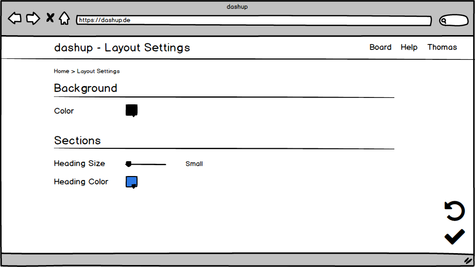

dashup - Use Case Specification: Layout - Change Layout
============================================
### Version 1.0

# Revision History

| Date       | Version | Description                                                            | Author        |
|------------|---------|------------------------------------------------------------------------|---------------|
| 28/10/2018 | 1.0     | Initial UCS with description, activity diagram and screen flow diagram | Joshua Schulz |

# Table of Contents

- [Change Layout - Brief Description](#1-change-layout---brief-description) 
- [Flow Of Events](#2-flow-of-events)
    - [Basic Flow](#21-basic-flow)
    - [Alternative Flows](#22-alternative-flows)
- [Special Requirements](#3-special-requirements)
- [Preconditions](#4-preconditions)
    - [System State](#41-system-state)
- [Postconditions](#5-postconditions) 
    - [Save Changed Data](51-save-changed-data) 
- [Extension Points](#6-extension-points)
 
# 1. Change Layout - Brief Description
In the use case _change layout_, the user can change the layout of his personal dashboard, e.g. the background color or font. 
These settings can be changed in a little layout menu. 

# 2. Flow of Events

## 2.1 Basic Flow

### 2.1.1 Activity Diagram

### 2.1.2 Mock-Up

### 2.1.3 Narrative

You can see the entire _.feature file_ right <a href="./change_layout.feature">here</a>.

## 2.2 Alternative Flows
N/A

# 3. Special Requirements
N/A

# 4. Preconditions

## 4.1 System State
Before this use case can be performed the user has to sign in and open up his main dashboard. From now on the layout
should be changeable at all time while the user is on his/her main dashboard.

#  5. Postconditions

## 5.1 Save changed Data
After the user has changed the layout or the structure of his/her dashboard the data has to be stored. This is necessary
to get a persistent change. 

#  6. Extension Points
N/A