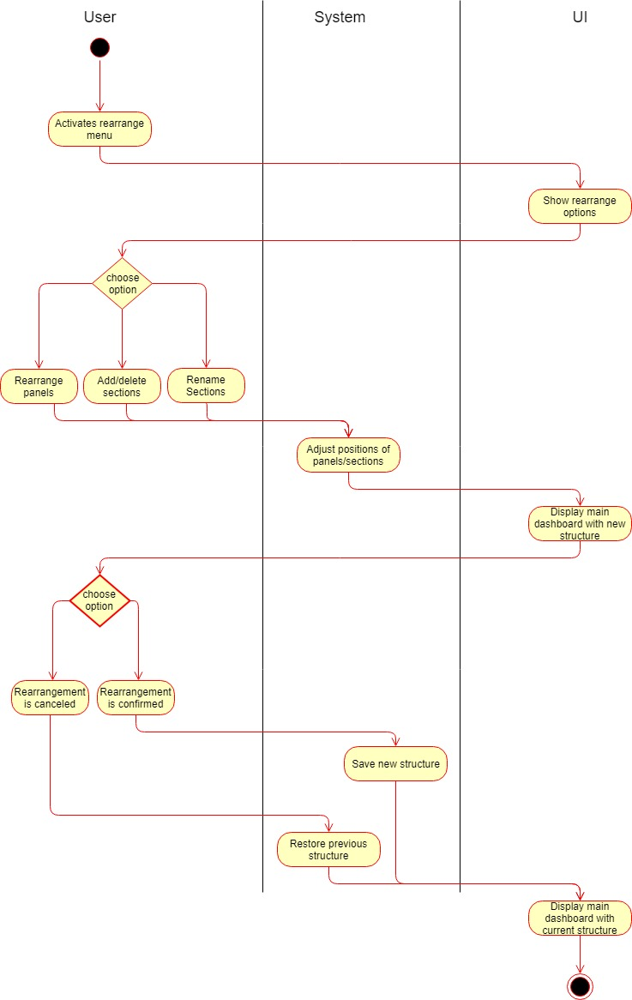
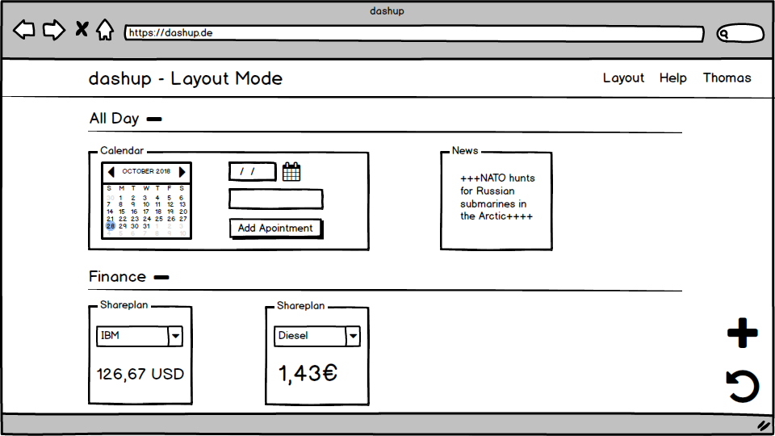
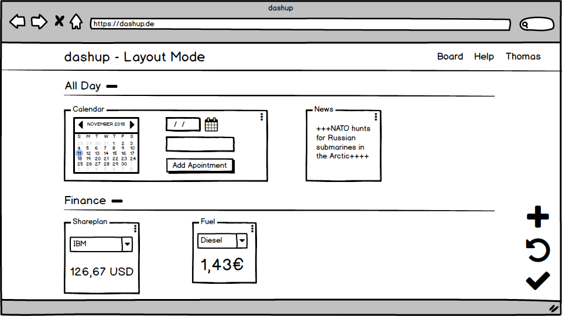
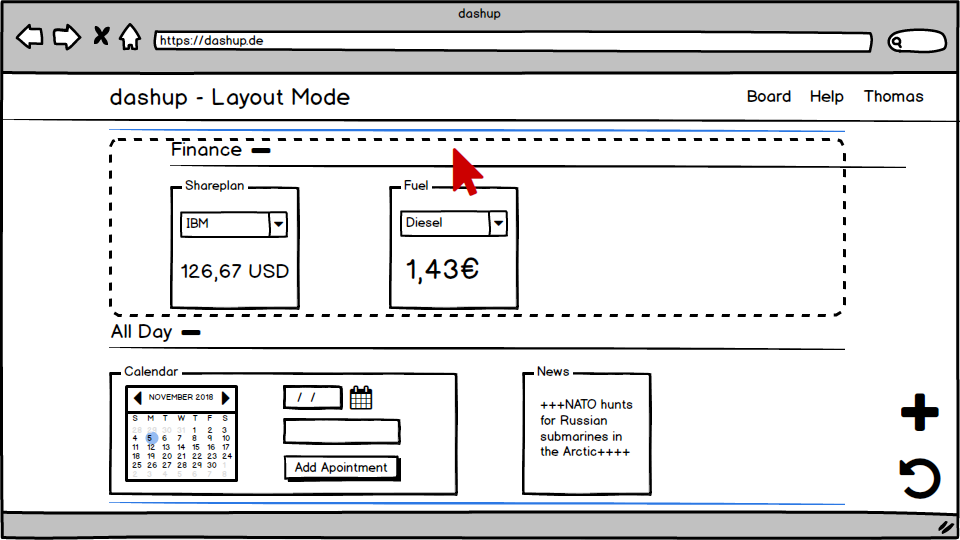
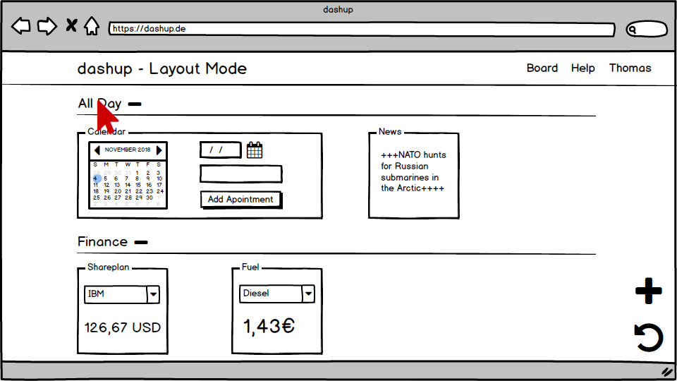
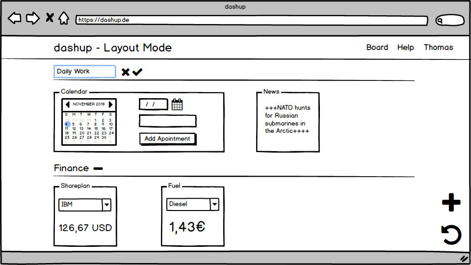
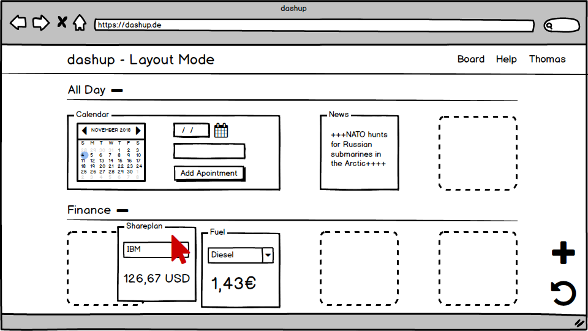
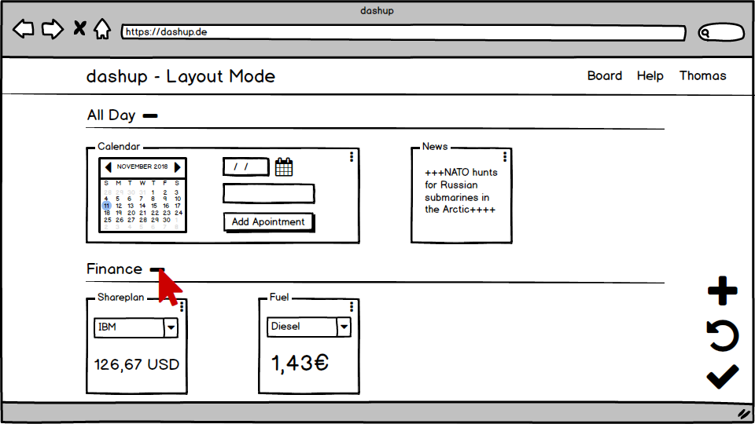

dashup - Use Case Specification: Layout - Change Panel Structure
============================================
### Version 1.0

# Revision History

| Date       | Version | Description                                                            | Author        |
|------------|---------|------------------------------------------------------------------------|---------------|
| 23/10/2018 | 1.0     | Initial UCS with description, activity diagram and screen flow diagram | Joshua Schulz |

# Table of Contents

- [Change Panel Structure - Brief Description](#1-change-panel-structure) 
- [Flow Of Events](#2-flow-of-events)
    - [Basic Flow](#21-basic-flow)   
    - [Alternative Flows](#22-alternative-flows)
- [Special Requirements](#3-special-requirements)
- [Preconditions](#4-preconditions)
    - [System State](#41-system-state)
- [Postconditions](#5-postconditions) 
    - [Save changed data](#51-save-changed-data)
- [Extension Points](#6-extension-points)

# 1. Change Panel Structure - Brief Description
In the use case _change panel structure_, the platform should enable the user to create, name and delete new sections and 
fill these sections with the desired panels. 
A rearrangement of sections as well as panels should be possible by drag and drop. 
Panels can be moved between sections and resized between small, medium or large.

# 2. Flow of Events

## 2.1 Basic Flow

### 2.1.1 Activity Diagram

 
### 2.1.2 Mock-Up

 

 

 

 

 

 

 

 

 

 

 

### 2.1.3 Narrative

You can see the entire _.feature file_ right <a href="./change_panelStructure.feature">here</a>.

## 2.2 Alternative Flows
N/A

# 3. Special Requirements
N/A

# 4. Preconditions

## 4.1 System State
Before this use-case can be performed the user has to sign in and open up his main dashboard. From now on the layout
should be changeable at all time while the user is on his/her main dashboard.

# 5. Postconditions

## 5.1 Save changed data
After the user has changed the layout of his/her dashboard the data has to be stored. This is necessary
to get a persistent change. 

# 6. Extension Points
N/A
