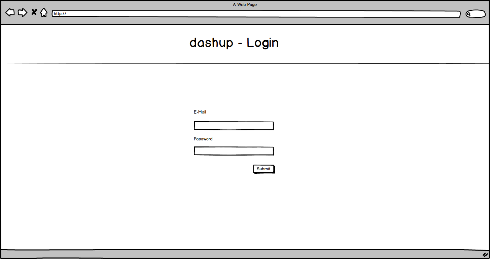
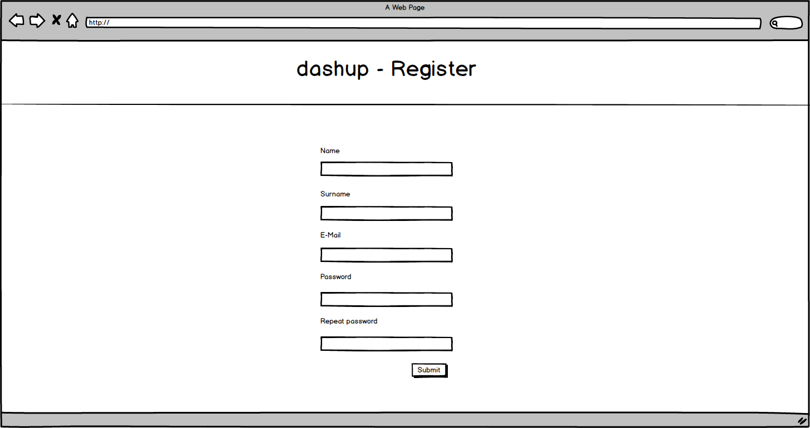

dashup - Use Case Specification: Login / Register
============================================
### Version 1.0

# Revision History

| Date       | Version | Description                                                            | Author          |
|------------|---------|------------------------------------------------------------------------|-----------------|
| 11/29/2018 |     1.0 | Initial UCS with description, activity diagram and screen flow diagram | Raphael Müßeler |

# Table of Contents

- [Use-Case Name - Brief Description](#1-use-case-name---brief-description) 
- [Flow Of Events](#2-flow-of-events)
    - [Basic Flow](#21-basic-flow)
    - [Alternative Flows](#22-alternative-flows)
- [Special Requirements](#3-special-requirements)
    - [First Special Reqiurement](#31--first-special-requirement-)
- [Preconditions](#4-preconditions)
    - [Precondition One](#41--precondition-one-)
- [Postconditions](#5-postconditions) 
    - [Postcondition One](#51--postcondition-one-) 
- [Extension Points](#6-extension-points)
    - [Name of Extention Point](#61-name-of-extension-point)

# 1. Use-Case Name - Brief Description

The use case _Login / Register_ provides the functionality that the user can create his own profile and the possibility to enter the application with his credentials. 

# 2. Flow of Events

## 2.1 Basic Flow

### 2.1.1 Activity Diagram

### 2.1.2 Mock-Up

 

 

 

 

### 2.1.3 Narrative

You can see the entire _.feature file_ right [here](./login_register.feature).

## 2.2 Alternative Flows

n/a

# 3. Special Requirements

n/a

# 4. Preconditions

## 4.1 Registering

Since registering is the first use case, there are no preconditions.

## 4.2 Login

The user ought to be registered, before the user can login into dashup. 

# 5. Postconditions

After registering, the respective user should be stored into database, so that he or she can login. Furthermore the user should be logged in after registering.

# 6. Extension Points

n/a