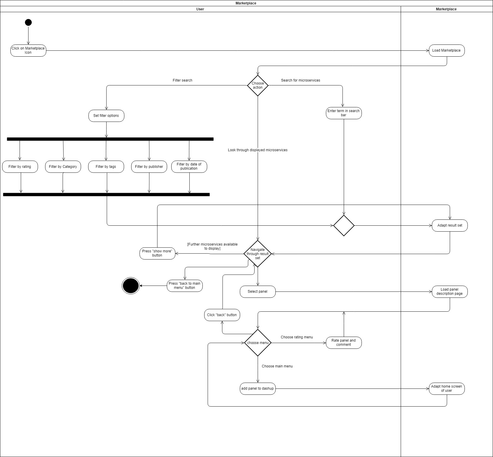

dashup - Use Case Specification: Marketplace
============================================
### Version 1.0

# Revision History

| Date       | Version | Description                                                            | Author           |
|------------|---------|------------------------------------------------------------------------|------------------|
| 28/10/2018 | 1.0     | Initial UCS with description, activity diagram and screen flow diagram | Felix Hausberger |

# Table of Contents

- [Marketplace - Brief Description](#1-marketplace---brief-description) 
- [Flow Of Events](#2-flow-of-events)
    - [Basic Flow](#21-basic-flow)  
    - [Alternative Flows](#24-alternative-flows)
- [Special Requirements](#3-special-requirements)
- [Preconditions](#4-preconditions)
    - [Sufficient amount of microservices](#41-sufficient-amount-of-microservices)
    - [Sufficient amount of ratings](#42-sufficient-amount-of-ratings)
    - [Metadata provided for each microservice](#43-metadata-provided-for-each-microservice)
    - [Logged in to dashup](#44-logged-in-to-dashup)
- [Postconditions](#5-postconditions) 
- [Extension Points](#6-extension-points)
   
# 1. Marketplace - Brief description

The use case _marketplace_ describes the functionality to browse through the internal
store of panels for microservices within dashup. Here users can rate, comment and add panels to 
their dashboard. 

# 2. Flow of Events

## 2.1 Basic Flow

### 2.1.1 Activity Diagram

### 2.1.2 Mock-Up

 

 

 

 

 

### 2.1.3 Narrative
TBD

## 2.2 Alternative Flows
N/A

# 3. Special Requirements
In order to add panels to one's own dashboard through the marketplace 
or to browse through the marketplace, a persistent internet connection is needed, 
to fetch data from the database.

# 4. Preconditions

## 4.1 Sufficient amount of microservices
To take use of the marketplace, a default amount of panels provided by the 
community should be available. If there are only the built-in dashup panels for certain microservices
available, the actual sense of a true _marketplace_ would get lost.

## 4.2 Sufficient amount of ratings
In order to get a good overview over the panel's quality, there should be a certain quantity of
ratings provided by the community in order to fill the rating menu of a panel with a 
decent amount of data.

## 4.3 Metadata provided for each microservice
To properly display information about a panel for a microservice, metadata such as version, publisher, etc. must be provided.
Furthermore the publisher must have given a detailed description about the panel to 
display it on the main menu of a panel in the marketplace.

## 4.4 Logged in to dashup
In order to use the marketplace, the user must be logged in to dashup.

# 5. Postconditions
After the use of the marketplace, the database should by synchronized according the actions 
that the user performed. 

# 6. Extension Points
N/A