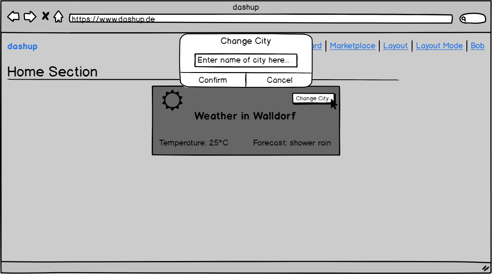
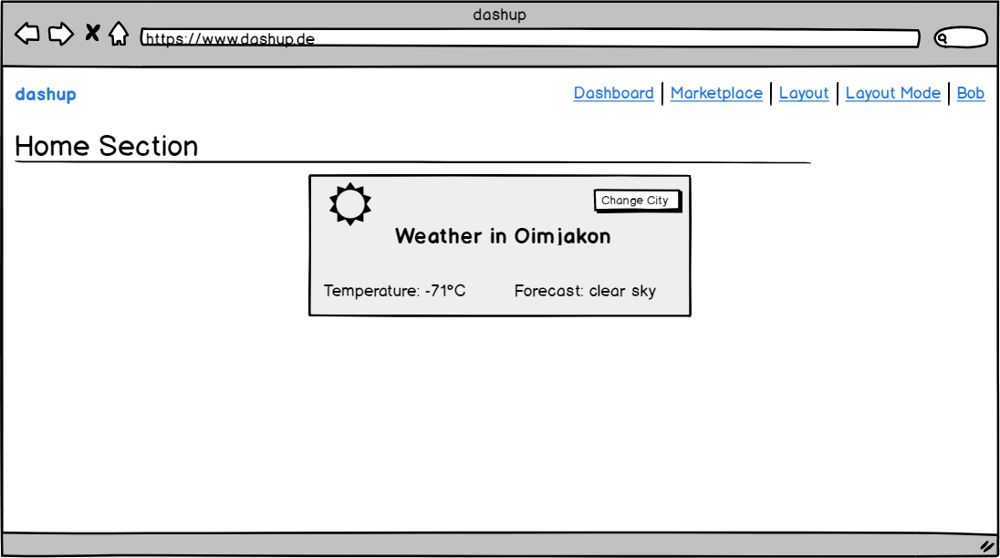

dashup - Use Case Specification: Panels - Panel's Basic Functionality
============================================
### Version 1.0

# Revision History

| Date       | Version | Description                                                            | Author           |
|------------|---------|------------------------------------------------------------------------|------------------|
| 09/12/2018 | 1.0     | Initial UCS with description, activity diagram and screen flow diagram | Felix Hausberger |

# Table of Contents

- [Panel's Basic Functionality - Brief Description](#1-panels-basic-functionality---brief-description) 
- [Flow Of Events](#2-flow-of-events)
    - [Basic Flow](#21-basic-flow)
    - [Alternative Flows](#22-alternative-flows)
- [Special Requirements](#3-special-requirements)
    - [Web Components](#31-web-components)
    - [API Response Format](#32-api-response-format)
- [Preconditions](#4-preconditions)
    - [Logged in to dashup](#41-logged-in-to-dashup)
    - [Correct Name of API](#42-correct-name-of-api)
    - [Necessary Attributes Defined](#43-necessary-attributes-defined)
- [Postconditions](#5-postconditions) 
- [Extension Points](#6-extension-points)
 
# 1. Panel's Basic Functionality - Brief Description
In the use case _panel's basic functionality_, the general usage of a panel on the dashup platform
is described. As each user can create custom panels, this document rather serves as a guideline 
for the design and usage of a panel and is therefore rather more technical oriented. 

# 2. Flow of Events

## 2.1 Basic Flow

### 2.1.1 Activity Diagram
As the usage of a panel differs from panel to panel, and as each panel embodies ist own functionality and usage, 
no basic flow chart can be created to summarize the usage of a panel. Sometimes panels will just display data without any 
interaction with the user, sometimes the user can give minimum input to the panel. This is one restriction of a panel, 
that matches with the actual idea behind dashup, that only delivers a dashboard and not entire applications.

### 2.1.2 Mock-Up

 

 

The image above gives an example of how a panel can look like. You can use the basic functionality by
using specific interaction components, like a button or an input field.

### 2.1.3 Narrative
The functionality of the application behind a panel is hosted on an external server (see UCD in SRS) and provided by its API.
Therefore, the functionality of a panel won't get tested. Only the mechanism of updating a panels content
is worth testing, but as the content of a panel itself is defined by the user, testing of a panel is not possible.

Possible tests for the technical point of view of a panel, that is implemented through web components, would be possible though. 
But as this is not related to a certain use case and not human readable as really technical sided, these functional tests remain internal.

## 2.2 Alternative Flows
N/A

# 3. Special Requirements

## 3.1 Web Components
To ensure, that users can lateron create custom panels, the process of creating the panels should be made as simple as possible.
Therefore dashup will provided predefined web components, that already embody certain behavior and characteristics.
Each panel consists out of several components, whereas default panels provided by dashup is a web component as a whole.
Rendering takes place in the Shadow DOM of the browser, the user only has to pass certain values for attributes to the component, that is:

- name: Name of the component in order to address it uniquely
- api: Address of the api of the user, that delivers the data to display
- param: name of parameter for the POST Request, whose value is added by the component (optional)
- action: use "data" to fetch data or "rfc" to make a remote function call with data of the component (optional, default: rfc)
- consumers: components, to which the response should be forwarded, in order to display the result (optional)

## 3.2 API Response Format
The API has to delivered to requested data in JSON format as key-value pairs.
The name of the key must equal to the name of the component, in order to assign the data 
correctly

# 4. Preconditions

## 4.1 Logged in to dashup
In order to use a panel, the user must be logged in to dashup.

## 4.2 Correct name of API
In order to make a correct request to the api, its name must be correct.

## 4.3 Necessary attributes defined
To make the panel work appropriately, all necessary attributes must be passed to the panel.

#  5. Postconditions
N/A

#  6. Extension Points
N/A