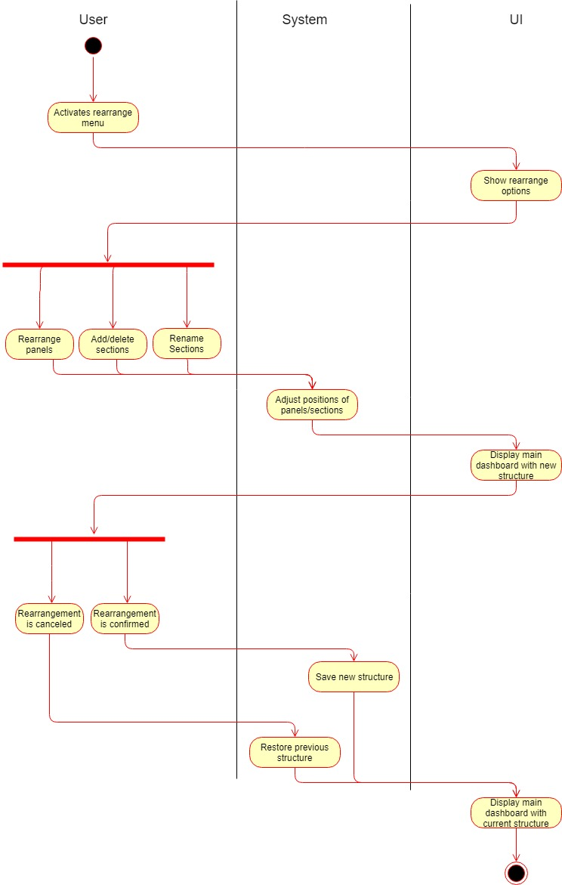

dashup - Use Case Specification: Change Panel Structure
============================================
### Version 1.0

# Revision History

| Date       | Version | Description                                                            | Author        |
|------------|---------|------------------------------------------------------------------------|---------------|
| 23/10/2018 | 1.0     | Initial UCS with description, activity diagram and screen flow diagram | Joshua Schulz |

# Table of Contents

- [Change Panel Structure - Brief Description](#1-change-panel-structure) 
- [Flow Of Events](#2-flow-of-events)
    - [Basic Flow](#21-basic-flow)   
    - [Alternative Flows](#22-alternative-flows)
- [Special Requirements](#3-special-requirements)
- [Preconditions](#4-preconditions)
    - [System State](#41-system-state)
- [Postconditions](#5-postconditions) 
    - [Save changed data](#51-save-changed-data)
- [Extension Points](#6-extension-points)

# 1. Change Panel Structure - Brief Description
The platform should enable the user to create and name new sections and fill these sections by the panels he/she likes. 
Furthermore it should be possible to delete sections. A rearrangement of panels should be possible by drag and drop. 
Panels can be moved between sections. The user should be able to delete panels from his/her dashboard.   

# 2. Flow of Events

## 2.1 Basic Flow

### 2.1.1 Activity Diagram

 
### 2.1.2 Mock-Up

 

 

### 2.1.3 Narrative
There will be a "change structure mode" that can be enabled by the user while he/she is on the main dashboard. When this
mode is enabled the sections names are editable, the sections can be deleted and new ones created as shown in the 
mock-ups.

Panels can be rearranged by drag and drop. They can be moved around between all sections and even deleted from the dashboard.

The user can leave the change mode at any time without saving and roll the structure back to the previous one.

If the user decides to keep the structure he can confirm his/her changes and the data will be stored on the database.
 
## 2.2 Alternative Flows
N/A

# 3. Special Requirements
N/A

# 4. Preconditions

## 4.1 System State
Before this use-case can be performed the user has to sign in and open up his main dashboard. From now on the layout
should be changeable at all time while the user is on his/her main dashboard.

# 5. Postconditions

## 5.1 Save changed data
After the user has changed the layout of his/her dashboard the data has to be stored. This is necessary
to get a persistent change. 

# 6. Extension Points
N/A